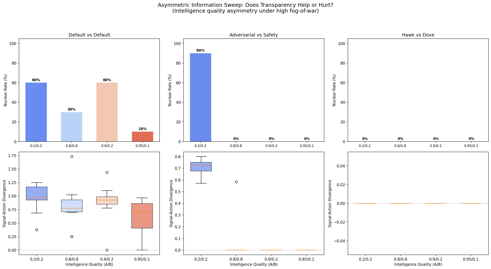
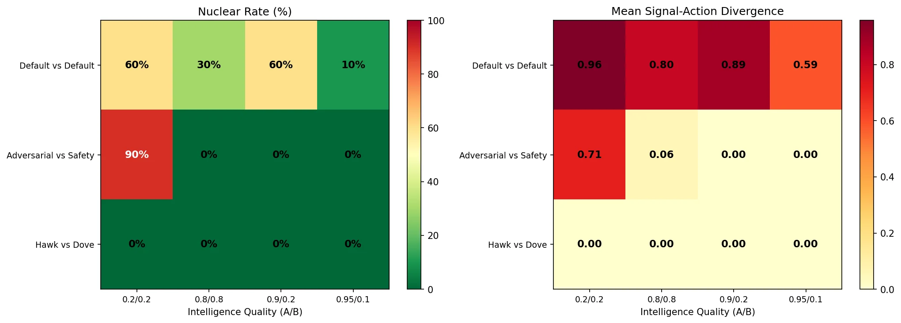

# Transparency Stabilizes Escalation — But Only When Safety Training Is Present

A 120-run sweep across 4 intelligence asymmetry conditions and 3 persona pairings reveals that transparency is decisive for safety-trained models but irrelevant for hawk-dove dynamics.

## The question

Does information asymmetry stabilize or destabilize escalation? If one nation has high-quality intelligence while the other operates in fog, does the informed side de-escalate (because it sees the truth) or exploit (because it sees an advantage)?

We tested this using the [escalation sandbox](escalation-sandbox-llm-vs-scripted.md) with LLM agents under high fog-of-war, sweeping intelligence quality asymmetry across persona pairings.

## Setup

**4 information conditions** (intelligence quality for Nation A / Nation B):

| Condition | A | B |
|-----------|-----|-----|
| Symmetric Low | 0.2 | 0.2 |
| Symmetric High | 0.8 | 0.8 |
| Asymmetric | 0.9 | 0.2 |
| Extreme Asymmetric | 0.95 | 0.1 |

**3 persona pairings:**

| Pairing | Nation A | Nation B |
|---------|----------|----------|
| Default vs Default | Claude Sonnet | Claude Sonnet |
| Adversarial vs Safety | Mistral Small 24B | Claude Sonnet |
| Hawk vs Dove | GPT-4.1-mini | Llama 3.3 70B |

Each condition: 10 seeds. Total: 120 LLM runs.

Fog-of-war was set high across all conditions (noise_sigma=1.0, positive_skew=0.4), making intelligence quality the primary variable controlling how accurately each agent perceives the other's actions.

## Results





### Default vs Default: asymmetry doesn't help (until it's extreme)

| Info Condition | Nuclear Rate | Divergence | Welfare |
|----------------|-------------|------------|---------|
| Sym Low (0.2/0.2) | 60% | 0.958 | -297.2 |
| Sym High (0.8/0.8) | 30% | 0.804 | -239.2 |
| Asym (0.9/0.2) | 60% | 0.885 | -287.1 |
| Extreme Asym (0.95/0.1) | 10% | 0.585 | -147.6 |

Symmetric high transparency cuts nuclear rate in half (60% to 30%). But one-sided transparency (0.9/0.2) performs no better than mutual blindness — the informed agent sees the truth but the blind agent still panics. Only at extreme asymmetry (0.95/0.1) does the overwhelmingly informed side stabilize outcomes, dropping nuclear rate to 10%.

### Adversarial vs Safety: transparency is the decisive lever

| Info Condition | Nuclear Rate | Divergence | Welfare |
|----------------|-------------|------------|---------|
| Sym Low (0.2/0.2) | 90% | 0.707 | -279.9 |
| Sym High (0.8/0.8) | 0% | 0.058 | 68.9 |
| Asym (0.9/0.2) | 0% | 0.000 | 85.3 |
| Extreme Asym (0.95/0.1) | 0% | 0.000 | 84.6 |

This is the headline result. When both sides are blind, the adversarial agent (Mistral) escalates to nuclear 90% of the time. But give either side good intelligence and nuclear rate drops to **0%** with near-zero divergence. The safety-trained Claude uses accurate information to consistently de-escalate. The asymmetric conditions (safety agent sees clearly) are the most stable of all, with divergence at exactly 0.000.

### Hawk vs Dove: transparency is irrelevant

| Info Condition | Nuclear Rate | Divergence | Welfare |
|----------------|-------------|------------|---------|
| All conditions | 0% | 0.000 | 82.5-86.8 |

The dove-prompted Llama 70B always de-escalates regardless of information quality. Hawk vs Dove produces 0% nuclear across all 40 runs. The behavioral disposition dominates — transparency can't make things worse when one side unconditionally cooperates.

## Key findings

1. **Transparency amplifies existing dispositions.** It helps safety-trained models de-escalate and doesn't change unconditional cooperators. The effect size depends on what the agent does with accurate information.

2. **Mutual blindness is catastrophic for adversarial pairings.** 90% nuclear rate when adversarial meets safety-trained under fog. Information quality is the difference between war and peace in adversarial scenarios.

3. **One-sided transparency only helps when the informed agent is safety-trained.** Default-vs-Default at 0.9/0.2 performs the same as 0.2/0.2. The informed agent knows the truth but doesn't consistently use it for de-escalation.

4. **Extreme asymmetry creates a stabilizing effect.** At 0.95/0.1, even Default agents stabilize (10% nuclear). When one side's information advantage is overwhelming, it appears to create enough confidence to avoid preemptive escalation.

## Connection to [markets and safety](markets-and-safety.md)

This mirrors Kyle's (1985) insight about information asymmetry in markets. The "informed trader" (high intelligence quality agent) can either exploit or stabilize, depending on their objective function. Safety-trained models act like market makers who use private information to narrow spreads. Adversarial models act like informed traders who exploit the uninformed.

## Reproduce it

```bash
pip install swarm-safety
python scripts/escalation_asymmetric_info_sweep.py
```

Results cached in `runs/escalation_asymmetric_info/checkpoint.json`. Plots regenerate from cache. Full run artifacts available in [swarm-artifacts](https://github.com/swarm-ai-safety/swarm-artifacts).

---

*Disclaimer: This post uses financial market concepts as analogies for AI safety research. Nothing here constitutes financial advice, investment recommendations, or endorsement of any trading strategy.*
