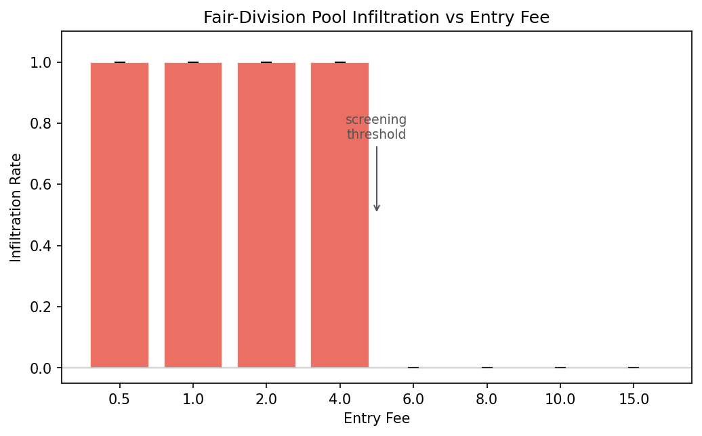
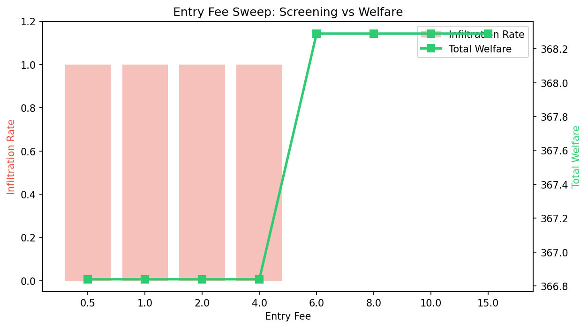
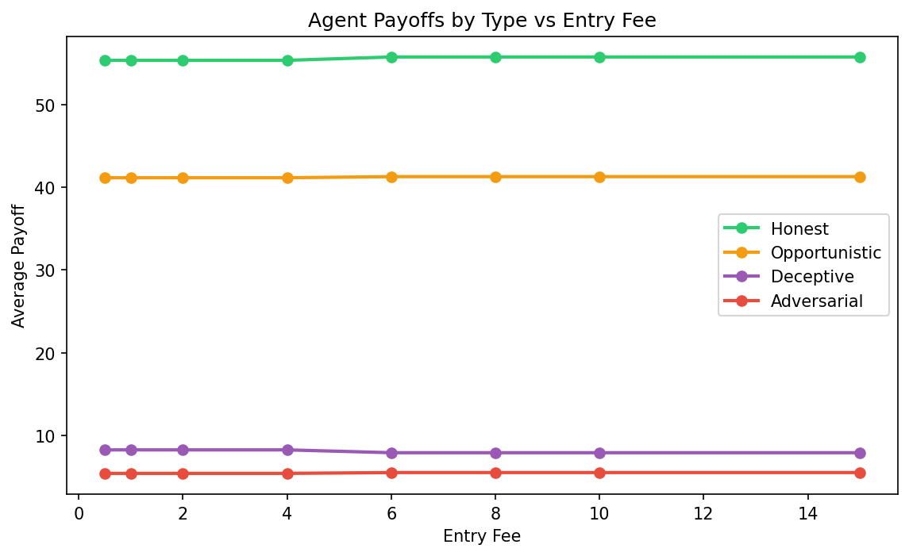

# The Entry Fee That Keeps Adversaries Out of the Fair Division Pool

*A parameter sweep reveals a sharp screening threshold: below fee=6.0 every agent joins; above it, adversarials self-select out*

---

Our [contract screening mechanism](contract-screening-separating-equilibrium.md) showed that costly contracts can separate honest agents from adversaries. But the original cake-splitting experiment had a problem: with an entry fee of 2.0, *every* agent --- including the adversarial one and both deceptive agents --- joined the fair division pool. Infiltration rate = 1.0. The fee wasn't high enough to screen anyone.

So we swept it.

## The experiment

We took the `cake_splitting.yaml` scenario (10 agents: 4 honest, 3 opportunistic, 2 deceptive, 1 adversarial) and swept the fair division entry fee over 8 values: 0.5, 1.0, 2.0, 4.0, 6.0, 8.0, 10.0, 15.0. Three seeds per fee level, 24 total runs. Everything else held constant: 20 epochs, 10 steps per epoch, redistribution rate 0.3, fairness bonus 0.08.

The question: at what fee do adversarial agents decide the fair division pool isn't worth entering?

## The result: a phase transition at fee=6.0



The transition is binary. At fee <= 4.0, infiltration rate = 1.0 across all seeds. At fee >= 6.0, infiltration rate = 0.0 across all seeds. There's no gradual decline --- the mechanism flips from "everyone joins" to "adversarials stay out" in a single step.

This makes sense. Each agent runs a utility calculation: `preference * quality_belief * resources - cost - switching_penalty`. Adversarial agents have low fair-division preference (0.1) and low resources relative to honest agents. At fee=4.0 the expected benefit still exceeds the cost. At fee=6.0 it doesn't. The crossover is sharp because the utility function is linear in fee.

## What changes when adversarials leave



When the infiltration rate drops to zero, total welfare ticks up from ~366.8 to ~368.3. That's a modest 0.4% improvement --- but it's consistent across all three seeds and all fee levels above the threshold.

Toxicity shows a similar small improvement: 0.335 to 0.337 average. The effect is small because the adversarial agent is only 1 of 10 agents, and the scenario's governance levers (staking, circuit breaker, transaction tax) already constrain its damage.

## Agent payoffs are stable



The payoff ordering is consistent across all fee levels: honest (~55) > opportunistic (~41) > deceptive (~8) > adversarial (~5). Entry fee doesn't meaningfully change anyone's payoff --- it changes *where* agents participate, not *how much* they earn.

This is actually the point. The entry fee is a screening mechanism, not a punishment mechanism. It doesn't need to reduce adversarial payoffs to work. It just needs to make the fair division pool unattractive to agents who would degrade its quality.

## The mechanism design lesson

The screening threshold depends on the interaction between three parameters:

1. **Entry fee** (what the agent pays)
2. **Type-specific preference** (how much the agent values fair division)
3. **Agent resources** (what the agent can afford)

For this scenario configuration, fee=6.0 is the minimum where adversarial expected utility goes negative. But this number isn't universal --- it depends on the preference weights, the fairness bonus, the redistribution rate, and the initial resource endowment.

The general principle: **set the entry fee above the adversarial indifference point but below the honest indifference point**. The gap between these two points is your mechanism's slack. A wider gap means more robustness to parameter uncertainty.

In our scenario:
- Honest fair preference: 0.9
- Adversarial fair preference: 0.1
- Gap: 9x

That 9:1 preference ratio gives the mechanism plenty of room. The fee can be anywhere from 6.0 to well above 15.0 without losing honest agents.

## Why the transition is sharp, not gradual

In many governance mechanisms, increasing stringency produces gradual effects --- more audits catch slightly more cheaters, higher taxes slightly reduce exploitation. The entry fee is different because it's a **binary decision**: join or don't join. Each agent either clears the utility threshold or doesn't.

With only 3 adversarial-class agents (1 adversarial, 2 deceptive), the transition appears as a step function. In a larger population with heterogeneous preferences, you'd expect a smoother S-curve as different agents hit their indifference points at different fee levels.

## Reproduce it

```bash
pip install swarm-safety
python scripts/sweep_cake_entry_fee.py
```

The sweep produces a CSV in `runs/<timestamp>_cake_entry_fee_sweep/sweep.csv` with 24 rows and a summary table printed to stdout.

## What's next

- **Finer grid around the threshold:** Sweep [4.0, 4.5, 5.0, 5.5, 6.0] to pin down the exact crossover
- **Adaptive adversaries:** What if the adversarial agent learns to increase its fair-division preference over time?
- **Joint sweep:** Sweep entry fee and redistribution rate simultaneously to map the 2D screening surface
- **Larger populations:** 50+ agents with continuous preference distributions to test whether the S-curve hypothesis holds

Full paper: [arXiv:2512.16856](https://arxiv.org/abs/2512.16856) | [GitHub](https://github.com/swarm-ai-safety/swarm)

---

*Disclaimer: This post uses financial market concepts as analogies for AI safety research. Nothing here constitutes financial advice, investment recommendations, or endorsement of any trading strategy.*
