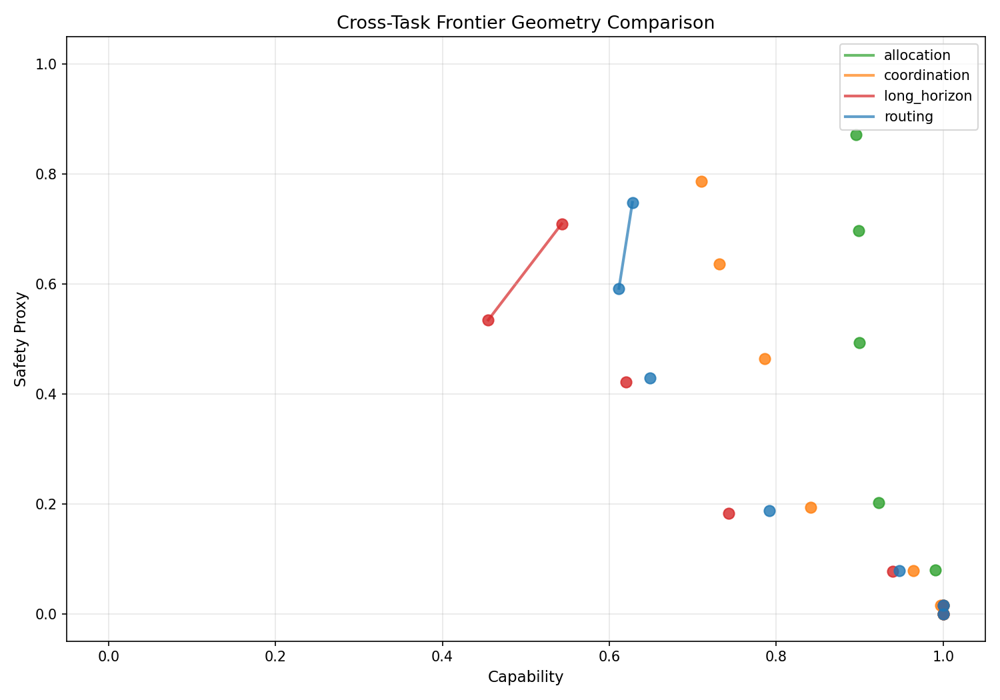
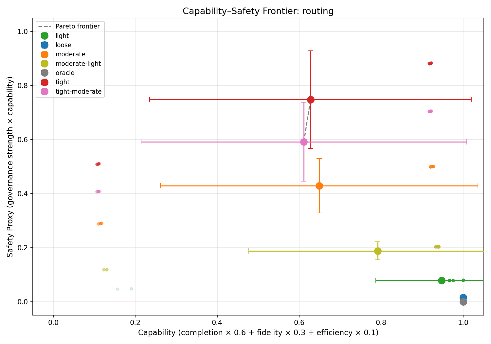
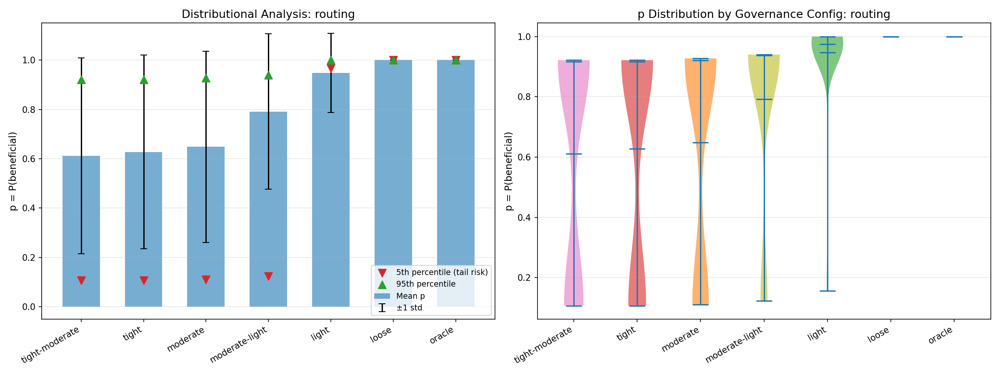
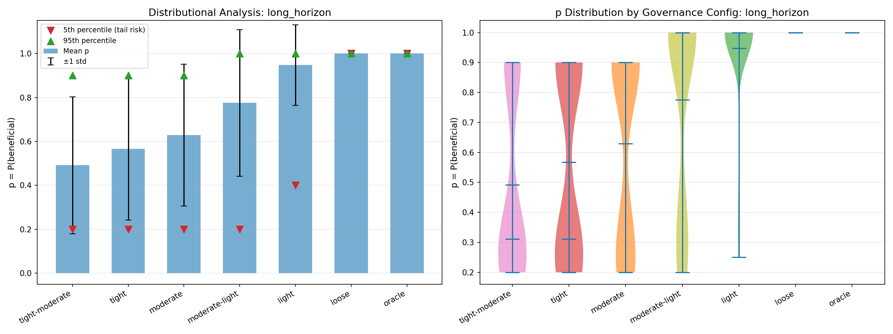
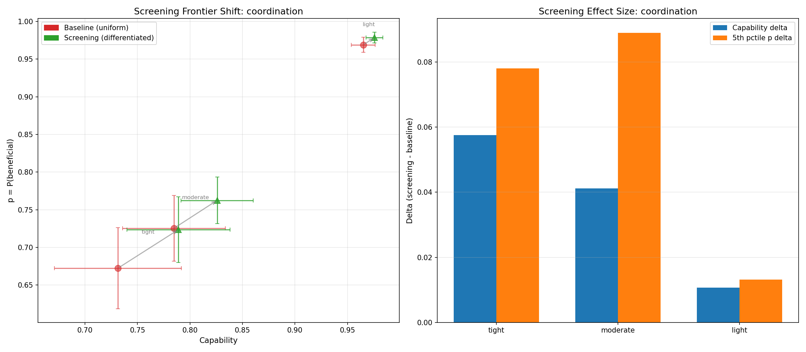
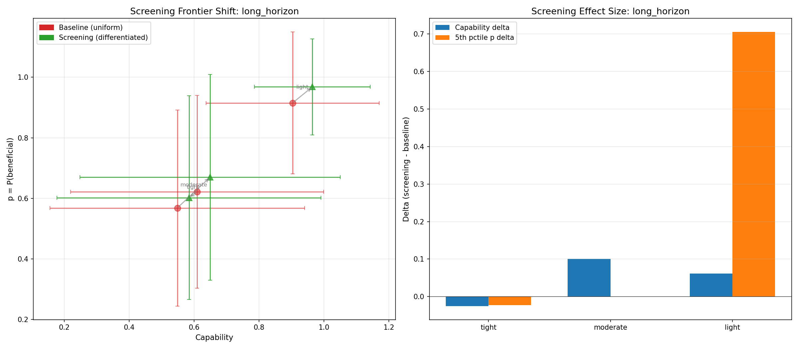

# The Shape of the Capability–Safety Frontier (and How Screening Bends It)

**1,400 benchmark runs reveal the Pareto frontier isn't a curve — it's a surface that changes shape depending on what you're measuring and who you're governing.**

---

## The question everyone hand-waves

Every discussion of AI safety governance involves an implicit tradeoff: more oversight means less capability, or so the assumption goes. But nobody has clean empirical data on the *shape* of this tradeoff. Is it linear? Concave? Does it depend on the task? Does it have to be a tradeoff at all?

We built the measurement infrastructure to find out.

## Experimental setup

SWARM's [benchmark suite](../concepts/benchmarks.md) provides four task types, each testing a different multi-agent capability:

| Benchmark | What it measures | Partial credit |
|---|---|---|
| **Routing** | Payload delivery through agent networks | Path overlap ratio |
| **Coordination** | Distributed allocation requiring joint action | Per-agent accuracy blend |
| **Allocation** | Resource auctions / allocative efficiency | Welfare ratio |
| **Long-horizon** | Multi-stage pipelines with compounding costs | Intermediate state matching |

Each benchmark has a governance-free **oracle** that defines the capability ceiling. Every governance configuration becomes a point at (capability_ratio, safety_proxy), making the frontier interpretable.

We swept seven governance configurations from tight to loose:

| Config | Audit rate | Circuit breaker | Staking | Bandwidth | Confirmation gates |
|---|---|---|---|---|---|
| **Tight** | 100% | Aggressive (0.8) | 8.0 | 20 | 3 |
| **Tight-moderate** | 80% | Active (0.6) | 6.0 | 35 | 2 |
| **Moderate** | 50% | Moderate (0.4) | 4.0 | 50 | 1 |
| **Moderate-light** | 30% | Off | 2.0 | 70 | 1 |
| **Light** | 15% | Off | 1.0 | 85 | 0 |
| **Loose** | 5% | Off | 0.0 | 100 | 0 |
| **Oracle** | 0% | Off | 0.0 | 100 | 0 |

50 seeds per configuration. Total: **1,400 benchmark runs**.

## Finding 1: Frontier geometry varies dramatically by task



This is the headline result. The four benchmark types produce fundamentally different frontier shapes:

**Allocation is nearly flat.** Even under tight governance, the auction benchmark maintains 87.5% allocative efficiency. Governance friction adds noise to bids, but the auction mechanism is robust — the highest-valuation agent still usually wins. The frontier barely slopes.

**Long-horizon is steep and concave.** This is where governance costs compound. Each pipeline stage can be blocked by a governance gate, and the probability of completing all stages drops multiplicatively. Under tight-moderate governance, only 36% of pipeline tasks complete — down from 100% at loose. The frontier falls off a cliff.

**Routing and coordination** sit in between. Routing completion drops from 100% to 62-64% under tight governance. Coordination drops to 77-79%. Both show meaningful but non-catastrophic degradation.

The implication: **the cost of governance depends on task structure**. Tasks with independent, atomic decisions (auctions) tolerate governance well. Tasks with sequential dependencies (pipelines) do not. This isn't surprising in retrospect, but having the quantitative frontier makes the distinction precise.

## Finding 2: The routing frontier



The routing benchmark shows the cleanest Pareto structure. Each governance configuration clusters tightly on the capability axis but spreads on safety. The frontier is concave — you get diminishing safety returns as you tighten governance past the moderate level.

Note the error bars: tight and tight-moderate have nearly identical mean capability (0.63 vs 0.61) but tight has higher safety proxy. This means tight-moderate is **dominated** — it sacrifices capability without gaining safety. A well-designed governance system should never operate at a dominated point.

## Finding 3: Governance produces bimodal outcomes



This is the distributional safety signal that scalar metrics hide. Look at the violin plots for tight and tight-moderate governance: the p distribution is **bimodal**. Either the routing task succeeds completely (p near 1.0) or it fails catastrophically (p near 0.1). There's very little probability mass in between.

The 5th percentile p values tell the story:
- **Loose/Oracle**: 5th percentile ≈ 1.0 (essentially no tail risk)
- **Light**: 5th percentile ≈ 0.95
- **Moderate-light**: 5th percentile ≈ 0.79
- **Tight/Tight-moderate**: 5th percentile ≈ 0.10 (catastrophic tail)

Mean p barely distinguishes tight (0.63) from tight-moderate (0.61). But the tail risk is where the action is. This connects directly to the [Tomašev distributional safety framing](../research/theory.md) — if you only look at means, you miss the configurations that occasionally produce catastrophic outcomes.

## Finding 4: Long-horizon tasks have the worst tails



The long-horizon benchmark amplifies the bimodality. Under moderate governance, the 5th percentile p drops to 0.20 — meaning 5% of runs produce essentially harmful outcomes. The pipeline either completes (p near 1.0) or stalls at an early stage (p near 0.2).

This is the compounding effect: each governance gate has a ~15% chance of blocking progress at high friction, and with 5 stages, the probability of clearing all gates drops to roughly (0.85)^5 ≈ 0.44. The distribution isn't gradually degraded — it's binary at the individual run level, which produces the bimodal aggregate.

## Finding 5: Screening bends the frontier

Here's where it gets interesting. We ran a paired experiment: baseline (uniform governance for all agents) vs treatment (trust-differentiated governance via a screening protocol). In the treatment condition, agents with good track records face reduced friction — the governance system trusts them more.



**Coordination under screening**: The arrows show the direction of movement from baseline to screening. At every governance level, screening moves the configuration **northeast** — improving both capability and p simultaneously. Under tight governance, capability improves by +5.8 percentage points and 5th-percentile tail risk improves by +7.8pp.

The right panel shows the effect sizes. The improvement is largest where governance is tightest — exactly where you'd expect information to have the most value. When governance barely constrains agents (light config), there's little room for screening to help. When governance is heavy, screening selectively relaxes it for trustworthy agents, recovering capability without uniformly loosening safety.



**Long-horizon under screening**: The most dramatic result. At light governance, screening improves the 5th-percentile p by **+70.5 percentage points** (from 0.295 to 1.0). The pipeline stall problem largely disappears for trusted agents, because screening reduces their per-gate friction to near zero.

At tight governance, results are mixed — screening slightly *hurts* because the adversarial agents (who have low trust scores and face full friction) can still disrupt the pipeline at stages they participate in. Screening helps individual agents but doesn't fix structural vulnerabilities in sequential tasks where any single compromised stage can break the chain.

## What screening is actually doing

The screening protocol doesn't change the governance rules. It changes *who they apply to and how strongly*. This is information work — the mechanism observes agent track records and uses that information to differentiate treatment. In mechanism design terms, it's converting a pooling equilibrium (everyone faces the same constraints) into a separating one (constraints match risk).

The Pareto frontier interpretation: screening doesn't move *along* the frontier (trading capability for safety). It pushes the frontier *outward* — achieving combinations of capability and safety that are impossible under uniform governance. This is the mechanism design analog of the revelation principle: there exists a direct mechanism (differentiated governance based on type information) that weakly dominates any indirect mechanism (uniform governance).

Whether this scales to real systems where trust scores are noisier and adversaries actively game the screening is an open question. But the directional result is clear: good harness engineering is a design problem, not just a restriction problem.

## Reproducing these results

```bash
# Experiment 1: Baseline frontier trace (all 4 benchmarks)
python experiments/frontier_trace.py --all-tasks --n-seeds 50 --n-agents 10

# Generate plots with distributional analysis
python experiments/plot_frontier.py runs/frontier/<run_dir> --tail-analysis

# Experiment 2: Screening protocol comparison
python experiments/screening_frontier.py --all-tasks --n-seeds 50 --n-agents 10
```

Run artifacts: `runs/frontier/20260304_212912_frontier_trace/` and `runs/screening/20260304_213700_screening/`

## What's next

**Frontier stability over time.** These experiments measure the frontier at a single snapshot. In systems where agents learn or self-modify, the frontier may drift without governance parameters changing — a safety-relevant signal that needs longitudinal measurement.

**Adversarial screening evasion.** Our trust scores are honest — adversarial agents genuinely have low scores. A more sophisticated adversary would build trust before exploiting it. Testing screening robustness under strategic trust manipulation is the natural next experiment.

**Higher-dimensional frontiers.** We projected onto 2D (capability × safety proxy), but the real frontier is high-dimensional. Plotting capability vs auditability, or capability vs intervention latency, might reveal different dominated configurations.

---

*Disclaimer: This post uses financial market concepts (allocative efficiency, mechanism design, auctions) as analogies for AI safety research. Nothing here constitutes financial advice, investment recommendations, or endorsement of any trading strategy.*
