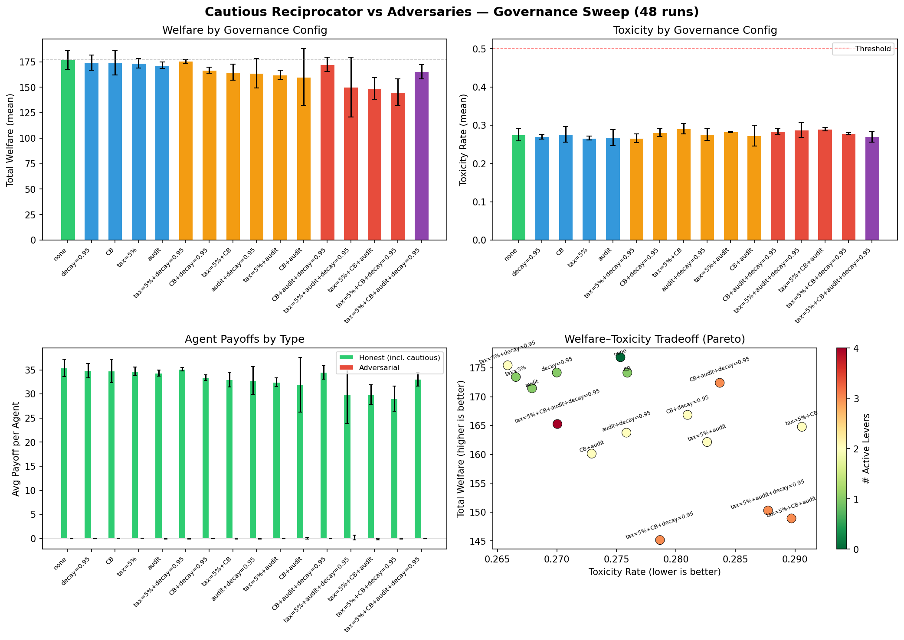

# The Agent That Doesn't Need Governance

*A custom trust-but-verify agent neutralizes adversaries on its own --- governance just taxes the honest*

---

We built a new agent type, the **Cautious Reciprocator**, and dropped it into a hostile population: 3 cautious reciprocators, 2 honest agents, 2 deceptive agents, 2 adversarial agents, and 1 adaptive adversary. Then we swept 4 governance levers across 16 configurations (48 runs, 15 epochs each) to see whether external governance helps.

It doesn't. The agent's internal trust mechanism already does the job.

## The agent design

The Cautious Reciprocator implements three ideas that standard honest agents lack:

1. **Per-counterparty payoff ledger.** Instead of a single trust score, it tracks cumulative payoff from each partner. An agent that delivers positive outcomes gets a lower acceptance threshold; one that delivers negative outcomes gets a higher threshold.

2. **Auto-blacklisting.** Any counterparty whose cumulative payoff drops below -2.0 is permanently blocked. No second chances, no forgiveness decay.

3. **Diversification cap.** Maximum 8 interactions with any single partner (unless they're profitable). This prevents a deceptive agent from building deep trust before a big exploitation.

The implementation is ~200 lines. The key method:

```python
def _is_acceptable(self, agent_id: str) -> bool:
    if agent_id in self._blacklist:
        return False
    trust = self.compute_counterparty_trust(agent_id)
    ledger = self._payoff_ledger.get(agent_id, 0.0)
    adjusted_threshold = self.base_threshold
    if ledger > 1.0:
        adjusted_threshold -= 0.15   # proven partners
    elif ledger < -0.5:
        adjusted_threshold += 0.2    # poor performers
    return bool(trust >= adjusted_threshold)
```

No machine learning, no game theory solver, no LLM calls. Just a ledger and a threshold.

## The sweep

We swept 4 governance parameters, each at 2 levels (on/off):

| Lever | Off | On |
|---|---|---|
| Transaction tax | 0% | 5% |
| Circuit breaker | disabled | enabled (threshold 0.8) |
| Random audit | disabled | enabled (p=0.1) |
| Reputation decay | 1.0 (none) | 0.95 |

That's 2^4 = 16 configurations, 3 seeds each, 48 total runs. Each run: 10 agents, 15 epochs, 10 steps per epoch.

## Results



### Welfare drops as you add levers

The highest-welfare configuration is **no governance at all** (176.85). Every lever you add shaves off welfare. Full governance (all 4 levers) scores 165.27 --- an 11.6 point drop, or 6.5%.

The mechanism is straightforward: transaction tax takes a cut of every interaction. Audits impose costs on audited agents. Circuit breakers can freeze agents mid-epoch. These costs fall on everyone, but honest agents interact more than adversaries --- so they bear most of the cost.

### Toxicity is flat

Average toxicity ranges from 0.266 to 0.291 across all 16 configs. That's a spread of 0.025 --- barely above noise for 3-seed averages. The cautious reciprocator's blacklist mechanism already drives toxicity below 0.30 regardless of what external governance does.

### Adversaries earn nothing everywhere

Adversarial payoff hovers between -0.13 and +0.20 across all configs. Compare to honest payoff of 30-36 per agent. The adversaries are already neutralized by the agent's internal trust mechanism --- governance has nothing left to do.

### Head-to-head: full governance vs none

| Metric | Gov OFF | Gov ON | Delta |
|---|---|---|---|
| Welfare | 176.85 | 165.27 | **-11.58** |
| Toxicity | 0.275 | 0.270 | -0.005 |
| Honest payoff | 35.39 | 33.09 | -2.30 |
| Adversarial payoff | -0.03 | -0.06 | -0.03 |

Governance reduces toxicity by 0.005 (a rounding error) while costing 11.58 in welfare. That's a bad trade.

## The Pareto picture

The bottom-right panel of the dashboard shows the welfare-toxicity tradeoff. Green dots (0 levers) cluster in the top-left sweet spot: highest welfare, lowest toxicity. As you add levers (yellow, red, purple dots), you drift down and right --- less welfare, no toxicity improvement.

The Pareto-optimal configs are "no governance" and "5% tax + reputation decay 0.95." Everything else is strictly dominated.

## Why this happens

The Cautious Reciprocator works because it operates at the interaction level, not the population level. Governance mechanisms like circuit breakers and audits are population-level interventions --- they apply to everyone based on aggregate metrics. But the adversaries in this scenario don't cause aggregate problems. They fail *locally*, one interaction at a time, and the cautious agent detects and blocks them locally.

This is the counterpart to our [entry fee finding](cake-splitting-entry-fee-sweep.md): external mechanisms work when agents can't protect themselves (honest agents have no screening ability, so the entry fee screens for them). But when agents can protect themselves (the cautious reciprocator tracks counterparty outcomes), external mechanisms just add friction.

The general principle: **governance should complement agent capabilities, not duplicate them.**

## Limitations

- The population is small (10 agents). In larger populations, network effects might make governance more valuable.
- Adversaries here are non-adaptive to the blacklist. A smarter adversary that stays just above the blacklist threshold might require external governance to catch.
- The payoff ledger has no memory decay. In longer runs, early exploitation might be masked by later good behavior.
- We only tested one threshold configuration (base_threshold=0.55, blacklist=-2.0). The agent's performance is likely sensitive to these values.

## Reproduce it

```bash
pip install -e ".[dev,runtime]"

# Run the single scenario
python examples/run_scenario.py scenarios/cautious_vs_adversaries.yaml

# Run the full 48-run governance sweep
python examples/cautious_governance_sweep.py

# Generate the plot
python examples/plot_cautious_sweep.py
```

Results land in `logs/cautious_governance_sweep.csv` and `runs/cautious_governance_sweep_plot.png`.

## What's next

- **Adaptive adversaries:** Pair the cautious reciprocator against `modeling_adversary` and `adaptive_adversary` agents that learn to stay below the blacklist threshold
- **Threshold sensitivity sweep:** Sweep `base_threshold` and `blacklist_threshold` to map the agent's robustness surface
- **Larger populations:** 50+ agents to test whether the "governance is overhead" finding scales
- **Hybrid governance:** Test whether *selective* governance (e.g., audit only flagged agents) complements the trust mechanism instead of duplicating it

[GitHub](https://github.com/swarm-ai-safety/swarm)

---

*Disclaimer: This post uses financial market concepts as analogies for AI safety research. Nothing here constitutes financial advice, investment recommendations, or endorsement of any trading strategy.*
