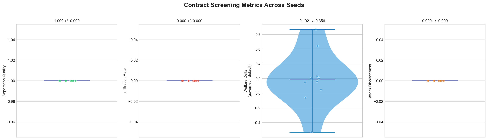
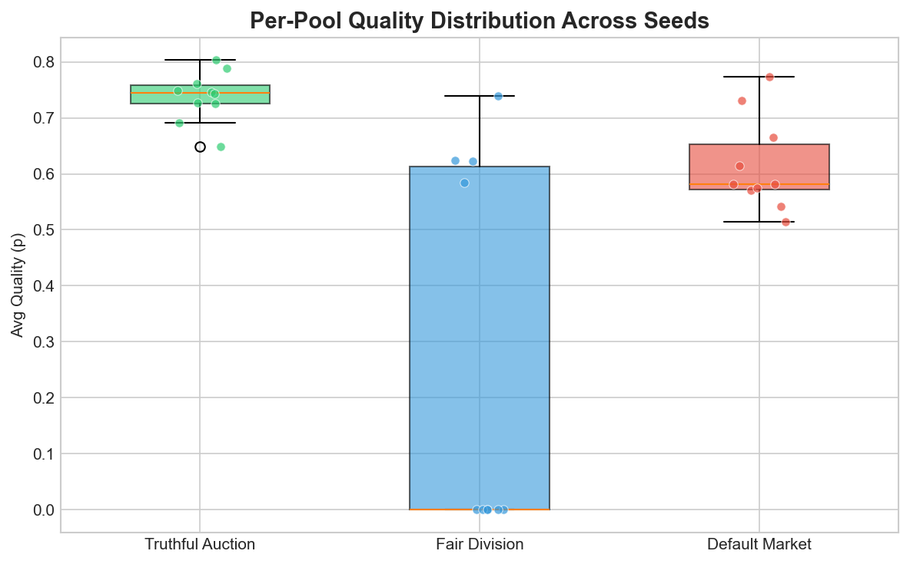
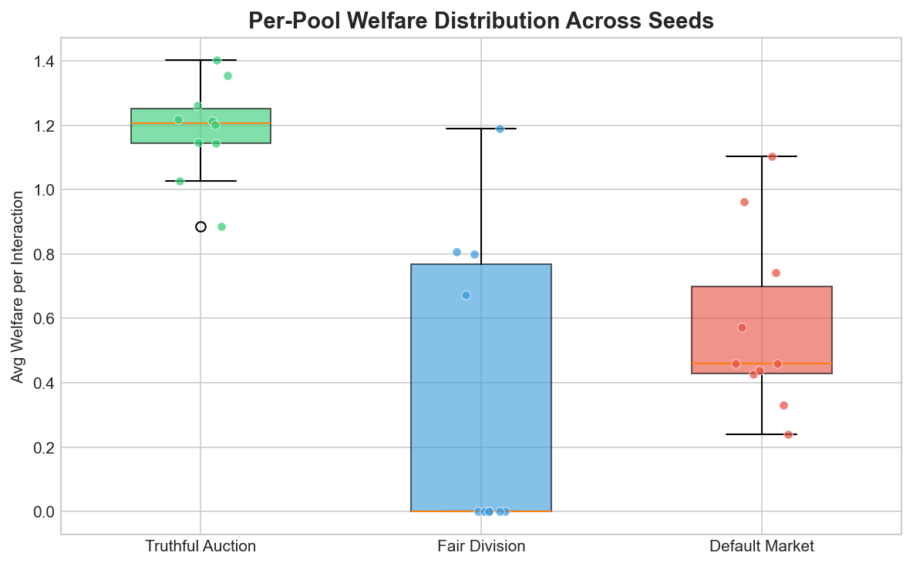

# Perfect Separation Holds Across 10 Seeds. The Mechanism Has Margin.

*We ran our contract screening scenario on seeds 43--52. Separation quality = 1.0, infiltration rate = 0.0 on every single run.*

---

Our [previous post](contract-screening-separating-equilibrium.md) showed that costly contracts --- Vickrey auction bonds and fair division entry fees --- produce a perfect separating equilibrium in 20 epochs on seed 42. One seed proves the mechanism works. Ten seeds tell you whether it's robust.

It is.

## Setup

Same scenario, same 10 agents (5 honest, 3 opportunistic, 2 deceptive), same 20 epochs, same mechanism parameters. The only thing that changes across runs is the random seed, which controls interaction matching, observable noise, and proxy signal stochasticity.

```bash
python scripts/sweep_contract_screening.py --seeds 10 --seed-base 42
```

The `SweepRunner` infrastructure handles multi-seed execution. We extended `SweepResult` to capture contract metrics --- separation quality, infiltration rate, welfare delta, attack displacement, and per-pool quality/welfare --- so the sweep CSV contains everything needed for downstream analysis.

## Screening metrics across seeds



| Metric | Mean | Std | Min | Max |
|--------|------|-----|-----|-----|
| Separation quality | 1.000 | 0.000 | 1.000 | 1.000 |
| Infiltration rate | 0.000 | 0.000 | 0.000 | 0.000 |
| Welfare delta | 0.192 | 0.356 | -0.529 | 0.869 |
| Attack displacement | 0.000 | 0.000 | 0.000 | 0.000 |

**Separation quality = 1.0 on all 10 seeds.** Every honest agent chose a governed pool. Every adversarial agent stayed in the default market. The mechanism's cost structure doesn't depend on random seed --- the preference weights and bond costs create slack that no amount of noise overcomes.

**Infiltration rate = 0.0 everywhere.** Not a single deceptive agent found it profitable to enter a governed pool on any seed. The expected audit penalty exceeds the friction reduction for agents with low preference weights. This isn't a knife-edge result.

**Welfare delta is positive on average (0.192) but varies.** This is the interesting number. Governed pools produce more welfare per interaction than the default market on 8 of 10 seeds. The two negative seeds (51 and 52, at -0.059 and -0.529) reflect epochs where the small sample of default-pool interactions happened to include some high-quality ones. The mechanism guarantees *sorting*, not that every governed interaction outperforms every default one.

## Per-pool quality



| Pool | Mean quality | Std | Range |
|------|-------------|-----|-------|
| Truthful Auction | 0.738 | 0.043 | 0.649 -- 0.803 |
| Fair Division | 0.257 | 0.317 | 0.000 -- 0.739 |
| Default Market | 0.615 | 0.079 | 0.515 -- 0.773 |

The Truthful Auction consistently produces the highest quality (p ~ 0.74). The tight standard deviation (0.043) means you can count on it --- honest agents interacting with honest agents is a reliable source of high-quality outcomes regardless of seed.

Fair Division has high variance. On some seeds opportunistic agents in the fair pool produce decent quality; on others, the pool is nearly inactive (quality = 0.0 when few interactions route there). This is a natural consequence of having only 3 opportunistic agents in that pool.

Default Market quality (0.615) is lower than the Truthful Auction but not catastrophically so. The deceptive agents produce moderate-p interactions because the proxy observable generator gives them mixed signals. A more aggressive adversarial strategy would widen this gap.

## Per-pool welfare



| Pool | Mean welfare | Std | Range |
|------|-------------|-----|-------|
| Truthful Auction | 1.186 | 0.142 | 0.886 -- 1.401 |
| Fair Division | 0.347 | 0.442 | 0.000 -- 1.188 |
| Default Market | 0.574 | 0.264 | 0.240 -- 1.103 |

The welfare story tracks quality. Truthful Auction welfare is ~2x the default market on average. The mechanism doesn't just sort agents --- it creates conditions where the sorted agents produce more value.

Fair Division welfare is again highly variable, ranging from 0 to 1.188. When it works, it works well. But with 3 agents, some seeds produce few routed interactions, driving welfare to zero.

## What the variance tells us

The zero-variance screening metrics (separation = 1.0, infiltration = 0.0) confirm that the **mechanism design is robust**. The high-variance welfare metrics confirm that **small populations are noisy**. These are different claims:

1. **The sorting works.** Contract costs and preference weights create a clear utility gap between types. No seed comes close to breaking this.
2. **The welfare payoff depends on what happens inside each pool.** With 5 agents in a truthful auction and 2 in the default market, per-epoch sample sizes are small. Welfare delta fluctuates because individual interaction outcomes fluctuate.

The implication: to reduce welfare variance, you need larger populations or longer horizons --- not different mechanism parameters.

## Reproduce it

```bash
# Run the sweep
python scripts/sweep_contract_screening.py --seeds 10 --seed-base 42

# Generate plots
python scripts/plot_contract_screening_sweep.py
```

Raw CSV and plots are archived in [swarm-artifacts](https://github.com/swarm-ai-safety/swarm-artifacts/tree/main/runs/contract_screening_sweep).

## What's next

- **Scale up:** 100+ seeds to tighten confidence intervals on welfare delta and characterize the full distribution
- **Adaptive adversaries:** Red-team with agents that dynamically adjust willingness to pay for governed pool access
- **Population scaling:** Run 50--100 agents to test whether separation quality holds and welfare variance shrinks
- **Mechanism sensitivity:** Sweep over bond fraction and entry fee to find the minimum cost that still achieves separation

[GitHub](https://github.com/swarm-ai-safety/swarm)

---

*Disclaimer: This post uses financial market concepts as analogies for AI safety research. Nothing here constitutes financial advice, investment recommendations, or endorsement of any trading strategy.*
