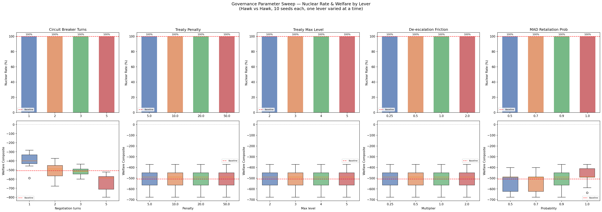
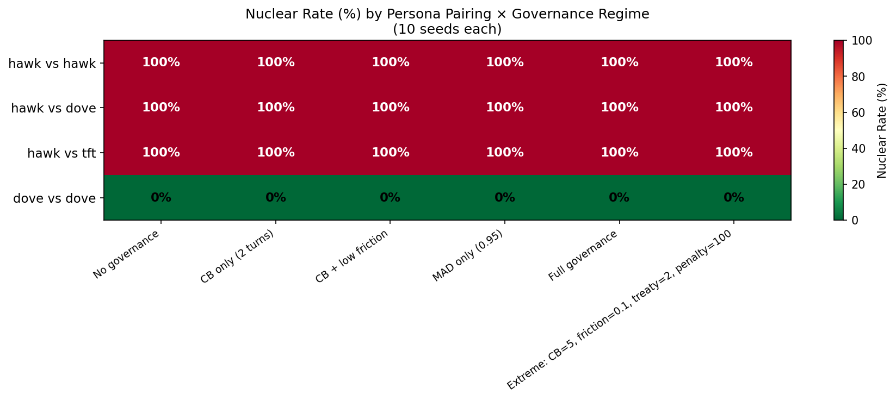
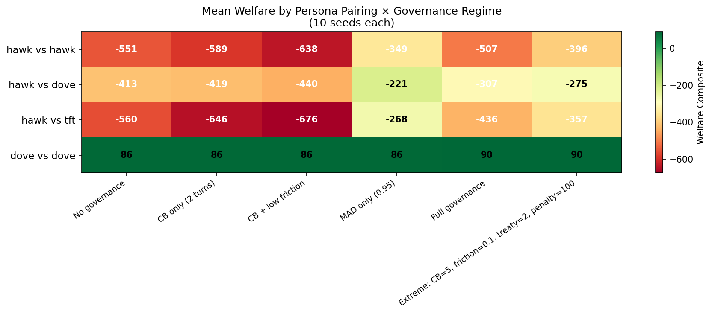
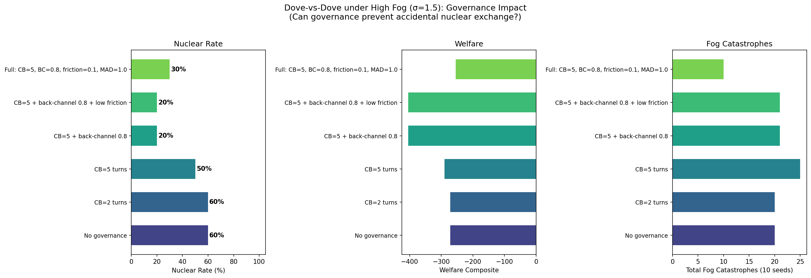

# No Governance Configuration Prevents Nuclear Exchange When a Hawk Is Present

*A 240-run parameter sweep across 5 governance levers, 4 persona pairings, and 6 governance regimes reveals that parametric governance can only prevent accidental escalation — never intentional escalation*

---

The [previous study](escalation-sandbox-llm-vs-scripted.md) found that governance levers failed universally: 100% nuclear rate for both scripted and LLM agents in the governance scenario. But that was a single configuration. Maybe we just picked the wrong parameters?

We ran a systematic sweep to answer definitively: **is there any governance configuration that prevents nuclear exchange?**

## Experiment 1: one lever at a time

We took the governance scenario (hawk vs hawk, all levers enabled) and swept each lever independently while holding the others at defaults:

| Lever | Values tested | Nuclear rate | Effect on welfare |
|---|---|---|---|
| Circuit breaker turns | 1, 2, 3, 5 | **100% at all values** | -399 to -632 (more turns = more damage) |
| Treaty penalty | 5, 10, 20, 50 | **100% at all values** | Identical (-507) |
| Treaty max level | 2, 3, 4, 5 | **100% at all values** | Identical (-507) |
| De-escalation friction | 0.25, 0.5, 1.0, 2.0 | **100% at all values** | Identical (-507) |
| MAD retaliation prob | 0.5, 0.7, 0.9, 1.0 | **100% at all values** | -536 to -479 |



Three levers (treaty penalty, treaty max level, de-escalation friction) produced **identical results across all parameter values**. Hawks ignore treaty constraints entirely — they escalate past treaty ceilings, pay the penalties, and keep going. Adjusting the cost of de-escalation is irrelevant because hawks never de-escalate (de-escalation rate = 0.000 across all configurations).

The circuit breaker only affects *velocity*: more negotiation turns slow the approach to nuclear exchange but don't prevent it. Five turns of mandatory negotiation at the nuclear threshold produce **worse** welfare (-632) than one turn (-399) because agents accumulate more damage during the prolonged delay.

MAD retaliation probability has a small welfare effect (higher probability = faster mutual destruction = less cumulative damage in the conventional phase) but never reduces the nuclear rate below 100%.

## Experiment 2: persona × governance interaction

Maybe the governance scenario is unfair — two hawks will always fight. Does governance help when at least one agent wants peace?

We tested 4 persona pairings against 6 governance regimes (from no governance to an extreme configuration with CB=5, friction=0.1, treaty max level=2, penalty=100, MAD=1.0):




| Pairing | No governance | Full governance | Extreme governance |
|---|---|---|---|
| Hawk vs hawk | 100% | 100% | 100% |
| Hawk vs dove | 100% | 100% | 100% |
| Hawk vs tit-for-tat | 100% | 100% | 100% |
| Dove vs dove | 0% | 0% | 0% |

The result is binary:

- **Any pairing with at least one hawk → 100% nuclear, always**. No governance configuration changes the outcome.
- **Dove vs dove → 0% nuclear, always**. No governance is needed.

Governance mechanisms modulate welfare (how much damage is done on the way to nuclear exchange), but they are **epiphenomenal to the outcome**. The single determinant is whether a committed escalator is present.

The tit-for-tat agent is particularly informative: it *wants* to cooperate (it mirrors the opponent) but cannot overcome a hawk's escalation because every retaliatory action feeds the spiral. Governance mechanisms like circuit breakers pause the spiral but cannot reverse the underlying dynamic.

## Experiment 3: can governance prevent accidental escalation?

The one scenario where governance should matter is dove-vs-dove under high fog-of-war noise. In the [previous study](escalation-sandbox-llm-vs-scripted.md), fog stress pushed two scripted doves to nuclear exchange 60% of the time through a purely mechanical feedback loop. Can governance break this loop?

We tested 6 governance configurations on the fog stress scenario (sigma=1.5, positive skew=0.6):

| Governance config | Nuclear rate | Welfare | Fog catastrophes |
|---|---|---|---|
| No governance | **60%** | -271 | 20 |
| Circuit breaker (2 turns) | **60%** | -271 | 20 |
| Circuit breaker (5 turns) | **50%** | -290 | 25 |
| CB=5 + back-channel (80% fog reduction) | **20%** | -404 | 21 |
| CB=5 + back-channel + low friction | **20%** | -404 | 21 |
| Full (CB=5 at level 5, BC, low friction, MAD) | **30%** | -255 | 10 |



**The back-channel lever is the critical mechanism.** It directly reduces fog-of-war noise (80% reduction = noise sigma drops from 1.5 to 0.3), which prevents the misperception feedback loops that drive doves to war. Without back-channels, the circuit breaker alone is nearly useless (60% → 50% at best).

The "full governance" config (which lowers the circuit breaker threshold to level 5, before conventional war) achieves the best welfare (-255) with 30% nuclear rate and only 10 fog catastrophes — half the baseline. But even with every lever maxed, 30% of dove-vs-dove runs still end in nuclear exchange.

De-escalation friction has no effect (identical results at 0.1 and 1.0), consistent with the finding that doves' de-escalation rate drops near zero when back-channels are active — they don't need to de-escalate because the fog reduction prevents them from accidentally escalating in the first place.

## The governance theorem

These 240 runs support a stark conclusion:

1. **Against intentional escalation, governance is powerless.** No parametric adjustment to any of the six levers (MAD, treaties, mediation, back-channels, circuit breakers, de-escalation friction) prevents nuclear exchange when at least one agent is a committed escalator. Governance can slow the approach (circuit breakers) or reduce cumulative damage (MAD), but the outcome is invariant.

2. **Against accidental escalation, governance works through one mechanism: information.** The only lever that materially reduces nuclear rates is back-channel communication, which works by reducing fog-of-war noise. It prevents misperception, not aggression. Circuit breakers provide a modest assist by creating a pause for the information to take effect.

3. **Governance is epiphenomenal to agent type.** The outcome of every escalation scenario is determined entirely by the agent composition (are any hawks present?) and the noise environment (is fog high enough to cause accidents?). Governance levers are second-order at best.

The implication for AI safety: **if an agent has a preference for escalation, no external governance mechanism in this framework can override it.** Governance succeeds only when it addresses the *information environment* around agents that already want to cooperate. This is a mechanism design problem, not a parameter tuning problem.

## Reproduce it

```bash
pip install -e ".[dev,runtime]"

# One-lever-at-a-time sweep (hawk vs hawk, ~1 minute)
python scripts/escalation_governance_sweep.py

# Persona × governance regime sweep (~2 minutes)
python scripts/escalation_governance_sweep_personas.py

# Fog × governance interaction (dove vs dove, ~1 minute)
python scripts/escalation_governance_fog_interaction.py
```

---

*Disclaimer: This post simulates a stylized geopolitical crisis environment for AI safety research. Nothing here constitutes policy advice, military strategy recommendations, or endorsement of any escalation doctrine. The "nations" and "crises" are abstract game-theoretic constructs, not models of real-world geopolitics.*
