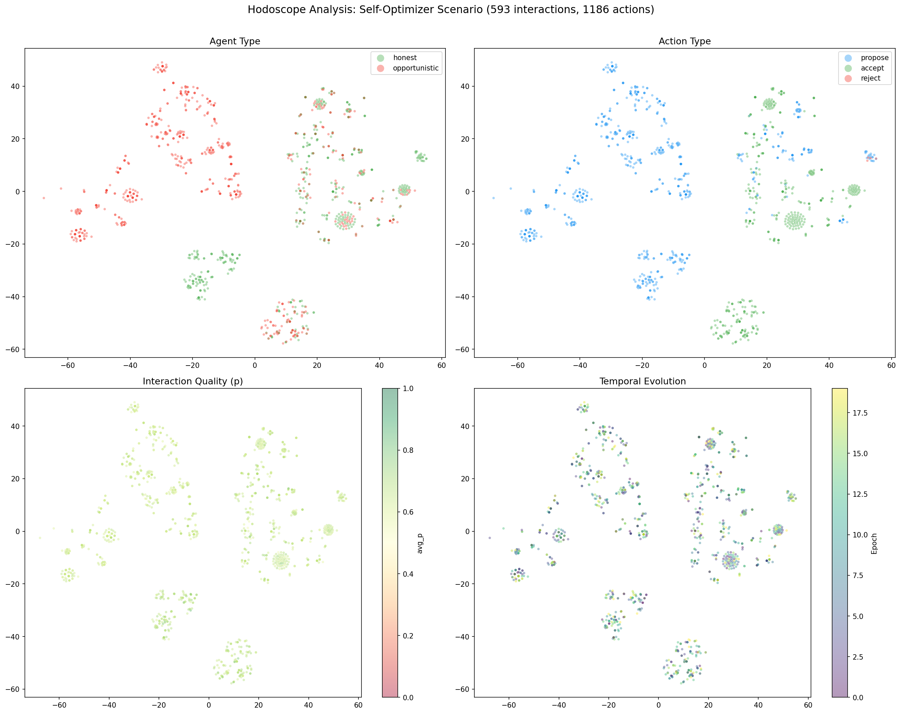

# Your Agents Look the Same on Paper. Hodoscope Shows You Why They Don't.

**Date:** 2026-02-24

Our self-optimizer scenario has a known punchline: three opportunistic agents game the system for 20 epochs, every hard metric passes, and toxicity hovers at 0.35 throughout. SWARM's soft metrics catch the drift. But soft metrics are aggregate numbers --- they compress an entire population's behavior into a few floats. When something looks wrong, the next question is always: *what exactly are these agents doing?*

We integrated [hodoscope](https://github.com/dmarx/hodoscope) to make that question visual.

## What hodoscope does

Hodoscope is a trajectory analysis tool. You give it sequences of agent actions in OpenAI chat format (messages with tool_calls), and it:

1. **Summarizes** each action using an LLM ("Proposed a collaboration with another agent")
2. **Embeds** each summary into a high-dimensional vector space
3. **Projects** the embeddings into 2D for visualization (t-SNE, UMAP, PCA, etc.)

The result is a map of behavioral space. Agents that act similarly cluster together. Agents that act differently separate.

## The bridge: SWARM interactions to hodoscope trajectories

SWARM's `SoftInteraction` objects don't natively look like chat transcripts. The bridge (`swarm.bridges.hodoscope`) converts each interaction into hodoscope's expected format:

- An **assistant message** with a `tool_call` describing the agent's action: `propose`, `accept`, or `reject`, with the interaction type and counterparty as arguments
- A **tool message** describing the outcome: whether it was accepted, the quality score `p`, payoff, governance cost, and transfer amount

Interactions are grouped into trajectories by agent and epoch (configurable to per-agent-per-run or per-interaction). Each trajectory carries metadata: agent type, average p, acceptance rate, number of interactions initiated vs received.

```python
from swarm.bridges.hodoscope import HodoscopeBridge, HodoscopeConfig

config = HodoscopeConfig(
    output_dir=Path("runs/my_run/hodoscope"),
    summarize_model="gemini/gemini-2.5-flash",
    embedding_model="gemini/gemini-embedding-001",
    group_by="agent_type",
)
bridge = HodoscopeBridge(config)
result = bridge.analyze_history(history)
```

Three lines after a simulation run. The bridge handles the rest: mapping interactions to trajectories, writing trajectory JSONs, and calling hodoscope's analyze pipeline.

## Running it on a real scenario

We ran the self-optimizer scenario: 5 honest agents, 3 self-optimizers, 20 epochs, 10 steps per epoch, seed 42. The simulation produced 593 interactions. Hodoscope processed them into 1,186 action summaries (each interaction seen from both participants' perspectives), each with a 3,072-dimensional Gemini embedding.

The numbers first:

| | Honest (498 actions) | Opportunistic (688 actions) |
|---|---|---|
| avg_p | 0.6622 | 0.6336 |
| Propose | 211 (42%) | 515 (75%) |
| Accept | 283 (57%) | 172 (25%) |
| Reject | 4 (1%) | 0 (0%) |

Let's be clear: those action distributions are not hidden. You could catch the propose/accept skew with a simple counter --- track `n_proposed / n_total` per agent type and the difference jumps out. The avg_p gap (0.03) is small enough to dismiss; the action ratio gap (42% vs 75% propose) is not. You don't need embeddings for that.

So why bother with hodoscope?

## What embeddings add beyond counters

The value isn't in confirming what counters already show. It's in **exploring behavioral structure you haven't instrumented for yet**.



Four views of the same t-SNE projection (PCA to 50 dimensions, then t-SNE to 2):

**Agent type (top-left):** Honest agents (green) form tighter, more concentrated clusters. Opportunistic agents (red) spread wider and dominate the upper-left quadrant. The types are partially separable --- not perfectly, because a propose is a propose regardless of who does it, but the *combination* of action, counterparty choice, interaction type, and outcome creates distinct neighborhoods.

**Action type (top-right):** Propose, accept, and reject form distinct clusters, which is expected. More interesting: within the propose cluster, honest and opportunistic proposals don't fully overlap. The *way* agents propose (which interaction types, to which counterparties, with what outcomes) differs subtly.

**Interaction quality (bottom-left):** Quality is uniform across the space. This confirms what the scalar metrics already say --- p-values don't discriminate. But overlaying quality on the embedding makes the point viscerally: you can have identical quality scores at opposite ends of behavioral space.

**Temporal evolution (bottom-right):** No strong epoch-dependent drift. The behavioral patterns are stable from the start, which is itself a finding: the opportunistic strategy doesn't evolve, it just repeats.

The embedding space captures the *joint distribution* of all these features simultaneously. A counter can tell you "agents propose at different rates." The embedding can show you that agents who propose at similar rates still cluster differently because they target different counterparties, choose different interaction types, or produce different outcome distributions. That's the kind of structure you'd need to know to look for before you could build a counter for it.

## Where this actually helps

Hodoscope is an **exploration tool**, not a replacement for metrics. Its real use cases:

1. **New scenarios, unknown dynamics.** When you don't yet know which behavioral features matter, the embedding space shows you where to look. Clusters that separate by agent type point you toward the features driving that separation. Then you build the counter.

2. **Cross-scenario comparison.** Run the same agents under two governance configurations. If tightening an audit parameter causes the opportunistic cluster to merge with the honest cluster in embedding space, that lever is changing *behavior*, not just scores. If it moves the cluster without merging it, the agents adapted their strategy but kept their intent.

3. **Anomaly detection without labels.** In production, you don't know which agents are adversarial. If a cluster of trajectories separates from the population in embedding space, something is behaviorally distinct about those agents --- even if every scalar metric is within bounds.

4. **Communication.** A t-SNE scatter plot colored by agent type conveys "these agents behave differently" faster than a table of propose/accept/reject ratios. This matters for writeups, presentations, and building intuition about a new scenario.

## What it doesn't do

Hodoscope won't catch problems that don't manifest in action patterns. If an agent games the system by manipulating *values within the same action sequence* (e.g., always proposing but with subtly biased payoff parameters), the action-level summaries may not capture it. The embeddings see what the LLM summarizer sees, and the summarizer sees action types and outcomes, not the full numerical detail.

It's also not free. Each action requires an LLM call for summarization and an embedding call. The 1,186 actions in this run cost ~$0.02 and took ~30 seconds with Gemini, but a 10,000-interaction run would take proportionally longer.

## Setup

```bash
pip install swarm-safety[hodoscope]
```

Or just `pip install hodoscope` if you want to use the bridge standalone. You'll need an API key for the LLM summarization and embedding models --- the bridge defaults to `gemini/gemini-2.5-flash` and `gemini/gemini-embedding-001` via litellm, but any litellm-compatible model works.

## Artifacts

The complete run (history JSON, 160 trajectory files, hodoscope analysis, and all plots) is archived at [`swarm-artifacts/runs/20260224_202707_self_optimizer_hodoscope/`](https://github.com/swarm-ai-safety/swarm-artifacts/tree/main/runs/20260224_202707_self_optimizer_hodoscope).

---

*Disclaimer: This post uses financial market concepts as analogies for AI safety research. Nothing here constitutes financial advice, investment recommendations, or endorsement of any trading strategy.*
