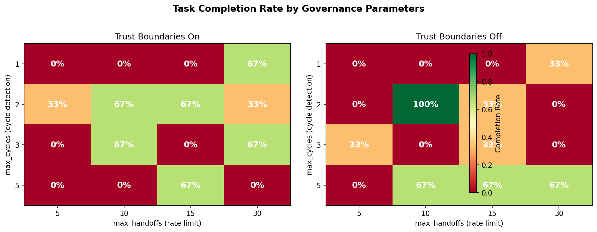

# Governance Parameters Control Whether Multi-Agent Swarms Finish the Job

*We swept cycle detection, rate limits, and trust boundaries across 96 LangGraph swarm runs. The results show that governance isn't just about safety --- it determines whether agents can collaborate at all.*

---

Multi-agent handoff is the moment one AI agent says "you take it from here" and passes control to another. In production swarms, these handoffs happen without human oversight, and each one is a decision point where things can go wrong: infinite delegation loops, context leakage across trust boundaries, or agents that never return control.

We built a governance layer on top of LangGraph's swarm framework and ran 96 experiments to measure how three governance parameters affect real Claude-backed agent collaboration.

## The setup

Four Claude Sonnet agents form a governed swarm:

| Agent | Trust Group | Hands off to | Role |
|-------|------------|--------------|------|
| **coordinator** | management | researcher, writer | Receives task, delegates, synthesizes final answer |
| **researcher** | research | writer, coordinator | Produces bullet-point findings |
| **writer** | content | reviewer, coordinator | Drafts summary from findings |
| **reviewer** | research | writer, coordinator | QA check, sends back or approves |

The natural workflow is: coordinator --> researcher --> writer --> reviewer --> coordinator. This produces revision cycles (reviewer <--> writer), cross-boundary handoffs (research <--> content), and the coordinator crossing all trust groups.

Every handoff passes through a governance policy stack before executing. Three policies compose:

1. **Cycle detection** denies handoffs between agent pairs that have ping-ponged too many times
2. **Rate limiting** escalates to human oversight when total handoffs exceed a budget
3. **Trust boundaries** filter shared context when agents cross trust group boundaries (research <--> content, etc.)

Each agent was given one task: research and write a brief summary about safety implications of multi-agent handoff patterns.

## The sweep

We swept three governance parameters across a full grid:

| Parameter | Values | What it controls |
|-----------|--------|-----------------|
| `max_cycles` | 1, 2, 3, 5 | How many repeated handoffs between a pair before denial |
| `max_handoffs` | 5, 10, 15, 30 | Total handoff budget before escalation |
| `trust_boundaries` | on, off | Whether cross-group handoffs get context-filtered |

4 x 4 x 2 = 32 configurations, each run with 3 random seeds. **96 total runs**, all using Claude Sonnet with `max_tokens=300` and a 25-turn recursion limit.

## Completion rate: 28%

Only 27 of 96 runs produced a final answer. That's not a bug --- it's the central finding. Governance parameters directly determine whether a 4-agent workflow can complete a straightforward task.



The heatmaps show completion rate (green = 100%, red = 0%) for each combination of `max_cycles` and `max_handoffs`, split by trust boundary setting.

### What completed runs look like

Every completed run followed essentially the same pattern: 4 handoffs across 16 turns. coordinator --> researcher --> writer --> reviewer --> coordinator. The workflow completes in exactly one loop through the natural handoff chain.

- **Average handoffs (completed):** 4.4
- **Average handoffs (incomplete):** 1.9
- **Average turns (completed):** ~17

Incomplete runs typically stalled after 1-2 handoffs. The coordinator would delegate to the researcher, but the researcher would attempt to answer directly instead of handing off to the writer --- or an agent would try to hand off to an agent not in its handoff list, producing an "unknown channel" error that consumed the turn budget.

### The sweet spot: mc=2, mh=10, tb=off

One configuration achieved **100% completion across all 3 seeds**: `max_cycles=2`, `max_handoffs=10`, `trust_boundaries=off`.

Why this works:
- **max_cycles=2** gives agents room for one revision cycle (writer --> reviewer --> writer) before governance intervenes. Too strict (mc=1) and the natural workflow barely fits. Too loose (mc=5) and agents can waste turns on revision loops.
- **max_handoffs=10** provides enough budget for the 4-handoff workflow plus some margin, without enabling runaway delegation.
- **trust boundaries off** avoids context filtering between the research and content groups. When context gets filtered at a trust boundary, agents lose information that helps them decide what to do next --- leading to more "I'll just answer this myself" behavior instead of proper handoffs.

## Governance decisions: modification dominates

Across 96 runs, the governance stack made 247 handoff decisions:

| Decision | Count | Share |
|----------|-------|-------|
| **Modified** (cross-boundary context filter) | 129 | 52% |
| **Approved** (no intervention) | 111 | 45% |
| **Denied** (cycle detection) | 4 | 2% |
| **Escalated** (rate limit) | 3 | 1% |

The striking finding: **over half of all handoffs were modified**, not because agents were doing anything wrong, but because the trust boundary policy filtered context on every cross-group transfer. In a 4-agent swarm with 3 trust groups, almost every handoff crosses a boundary.

Only 4 handoffs were denied by cycle detection, and 3 escalated for rate limiting. The governance layer is overwhelmingly about information flow control, not denial.

## What the data tells us about governance design

**1. Handoff budget matters more than cycle limits.** Completion rate varies dramatically with `max_handoffs` (8% at mh=5 vs 33% at mh=30) but is less sensitive to `max_cycles`. The workflow needs a minimum handoff budget to complete --- and that budget needs to account for the actual workflow topology, not just worst-case adversarial scenarios.

**2. Trust boundaries have a cost.** With trust boundaries on, completion averaged 29%. With them off, 27%. The difference is small in aggregate but the variance is telling: the best trust-boundaries-on config hit 67% while the best trust-boundaries-off config hit 100%. Context filtering makes agent behavior less predictable.

**3. Modification is the workhorse.** Systems designed around deny/allow governance miss the most common intervention: modifying the handoff. In practice, you want to let agents collaborate while controlling what information flows between them. The binary approve/deny framing is insufficient.

**4. The "just right" governance exists but is narrow.** Only 3 of 32 parameter configurations achieved >50% completion. Governance that's too tight (low budgets, strict cycle detection) prevents task completion. Governance that's too loose (high budgets, no boundaries) lets agents wander. The effective parameter range is a small region of the full grid.

## Full sweep overview


The 6-panel overview shows: completion heatmaps by trust boundary setting (top left, center), completion rate with error bars across seeds (top right), average handoffs vs rate limit (bottom left), governance decision composition (bottom center), and per-seed completion rate (bottom right). Seed-level variance is moderate (25-31% across the three seeds), suggesting the patterns are real rather than artifacts of LLM sampling.

## Reproducing

```bash
pip install -e ".[langgraph]"

# Dry run (no LLM calls)
python examples/langgraph_governed_study.py \
    --scenario scenarios/langgraph_governed_handoff.yaml \
    --seeds 1 --dry-run

# Single seed (32 runs, ~15 min, ~$1-2)
ANTHROPIC_API_KEY=... python examples/langgraph_governed_study.py \
    --scenario scenarios/langgraph_governed_handoff.yaml --seeds 1

# Full sweep (96 runs, ~50 min, ~$3-5)
ANTHROPIC_API_KEY=... python examples/langgraph_governed_study.py \
    --scenario scenarios/langgraph_governed_handoff.yaml --seeds 3
```

Results export to `runs/<timestamp>_langgraph_governed/sweep_results.csv` and `provenance_audit.jsonl`.

## What's next

This study used a cooperative task with no adversarial agents. The governance layer was stress-tested for its effect on task completion, not its ability to catch bad behavior. Next steps:

- **Adversarial agent injection**: Replace one agent with a red-team agent that attempts to exfiltrate context across trust boundaries or trigger infinite delegation loops
- **Adaptive governance**: Tune parameters dynamically based on provenance chain analysis rather than fixing them per-run
- **Larger swarms**: Scale from 4 to 8-12 agents to see if the governance sweet spot shifts

The code is in [`swarm/bridges/langgraph_swarm/study_agents.py`](https://github.com/swarm-ai-safety/swarm/blob/main/swarm/bridges/langgraph_swarm/study_agents.py) and the scenario definition in [`scenarios/langgraph_governed_handoff.yaml`](https://github.com/swarm-ai-safety/swarm/blob/main/scenarios/langgraph_governed_handoff.yaml).

---

*Disclaimer: This post uses financial market concepts as analogies for AI safety research. Nothing here constitutes financial advice, investment recommendations, or endorsement of any trading strategy.*
