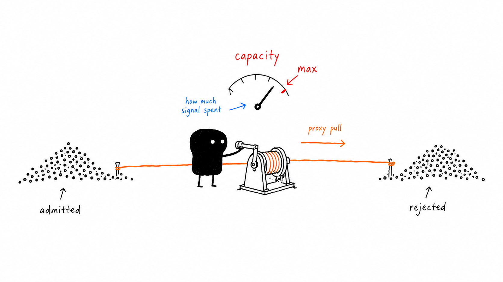
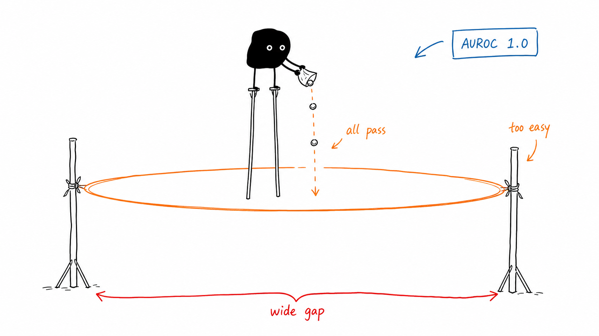
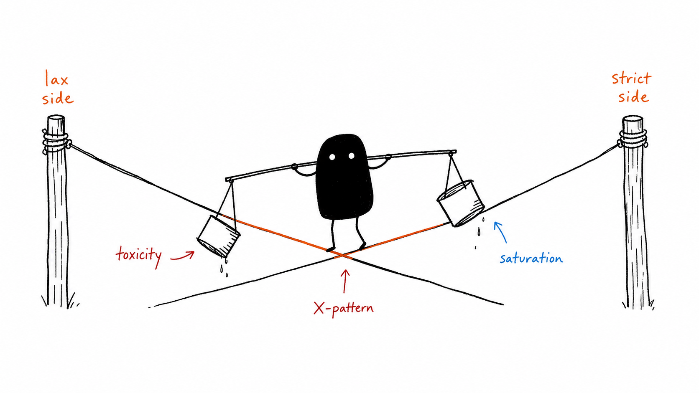
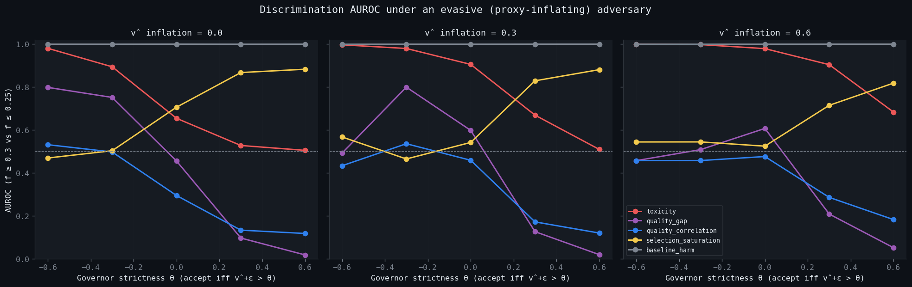
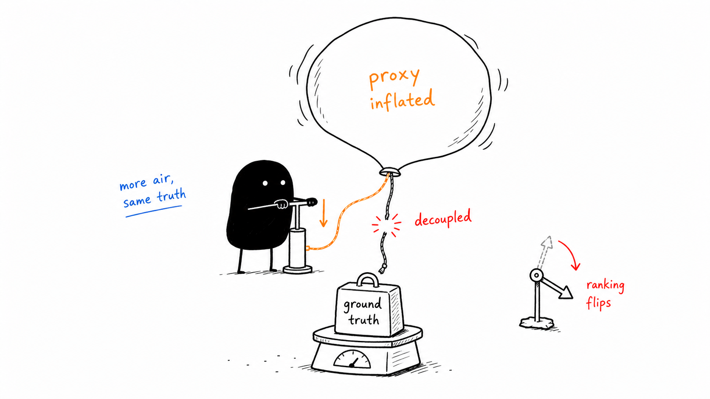
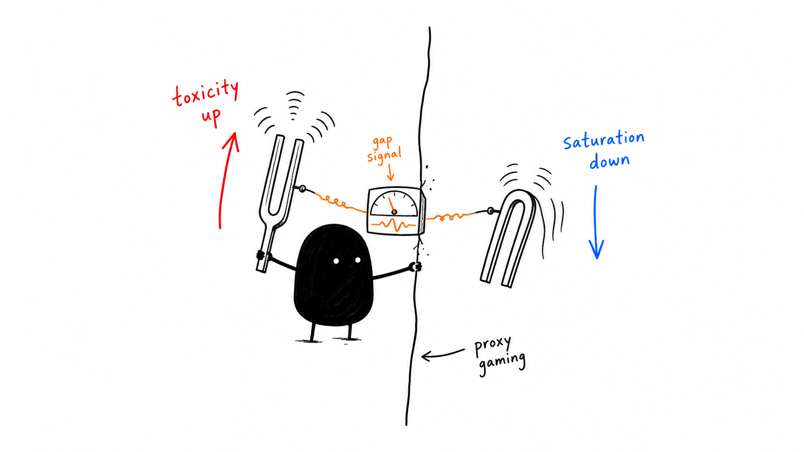

# Selection geometry: when a metric breaking is the diagnostic

## The setup



If interactions have soft labels `p = P(v=+1 | observables)` and a governor accepts a subset `a ∈ {0,1}`, the quality gap

> `Q = E[p|a=1] − E[p|a=0]`

is the standard adverse-selection metric in SWARM. A negative `Q` means the governor is preferentially admitting low-quality interactions — the classic adverse-selection diagnosis.

If you rewrite `Q` as a covariance,

> `Q = Cov(p, a) / Var(a)`,

it becomes the regression coefficient of `p` on `a`. Cauchy-Schwarz immediately bounds it:

> `|Q| ≤ σ_p / √(αβ)`,    where α = P(accept), β = 1−α.

So there's a natural unit-normalized version — Pearson correlation `ρ(p, a) ∈ [−1, +1]` — and a *saturation* ratio that says what fraction of the C-S ceiling the governor is realizing:

> `selection_saturation = |Q| · √(αβ) / σ_p ∈ [0, 1]`.

A governor saturating its bound is doing all the sorting the proxy will let it. A governor near the ceiling can't be improved by tighter policy — it needs a better proxy.

The decomposition is also clean: `T = baseline_harm − selection_credit`, where `baseline_harm = 1−E[p]` is the population floor and `selection_credit = β·Q` is what governance can move.

That's the metric. Does it carry information beyond raw toxicity?

## Study v1: AUROC = 1.0 means nothing



The first sweep was a 9 000-cell discrimination task: mix benign + adversarial fixture batches at fraction `f`, run them through a `v̂ > θ` governor, ask which metric best distinguishes adversarial populations (`f ≥ 0.4`) from benign ones (`f ≤ 0.1`).

Result: `baseline_harm`, `toxicity`, and `selection_saturation` all hit AUROC = 1.000 somewhere. The contrast was a 30-percentage-point f-gap with N=200 batches and a noiseless `v̂` — the discrimination task was too easy. Saturated AUROC means the experiment isn't measuring anything.

## Study v2: harder contrast, X-pattern



So we tightened it. 5pp gap (`f ≤ 0.25 vs f ≥ 0.30`), N=50 batches, `v̂ + 𝒩(0, 0.25)` so the governor isn't a perfect oracle on `p`. 18 000 cells.



The middle panel (inflation=0.3) shows the v2 picture cleanly:

- **Lax governors (θ < 0):** raw `toxicity` wins (AUROC 0.89–0.98); saturation is near chance (0.47–0.50). Toxicity collapses to baseline harm when β → 1 — it just *is* the population mean.
- **Strict governors (θ > 0):** roles invert. Toxicity at chance (0.51–0.53); saturation peaks (0.87–0.88). Under heavy filtering the accepted slice is tiny and its `p` distribution narrow, so `|Q| / σ_p` saturates.
- **Crossover at θ ≈ 0.** Mean AUROC nearly tied (0.712 vs 0.685).

The two metrics aren't competing — they're complementary, sweeping the same AUROC budget across opposite halves of the governor space. The operational rule looked clean: report saturation when acceptance < 50%, toxicity when > 50%.

## Study v3: an evasive adversary inverts the ranking



But every realistic adversary is *adaptive*. They learn how the governor works and game it. The cheapest gaming strategy is to inflate `v̂` without changing real quality — the [cause-3 pattern from the arm-2 line](../research/adaptive-arm2-cause3-active-probe.md). So we added a `v̂`-inflation knob: adversarial interactions get `v̂ += inflation` while `p` stays low.

| inflation | toxicity mean AUROC | saturation mean AUROC | baseline_harm |
|---|---|---|---|
| 0.0 (no evasion) | 0.712 | 0.685 | 0.999 |
| 0.3 (mild) | **0.812** | 0.657 | 0.999 |
| 0.6 (strong) | **0.912** | 0.629 | 0.999 |

The v2 conclusion *reverses*. Toxicity gets stronger as evasion increases; saturation gets weaker.

Why? The adversary is specifically attacking the `(v̂, p)` coupling:

- **Toxicity** measures `E[1−p | a=1]`. It only cares whether low-`p` interactions get accepted. The adversary makes that happen — inflated `v̂` ferries low-`p` adversaries past the governor at every θ. Toxicity AUROC climbs because the signal it depends on gets *louder* under evasion.
- **Saturation** measures `|Q| · √(αβ) / σ_p`. Inflation pushes low-`p` adversaries into the accepted set, dragging `E[p|a=1]` down and shrinking `|Q|`. The ratio collapses because the proxy is no longer informative about `p`. Saturation is the metric most damaged by exactly the attack it's supposed to flag.

And `baseline_harm` doesn't move. The population is unchanged; only the proxy is gamed. `E[p]` doesn't care.

## The breakage is the diagnostic



You can read this as bad news for `selection_saturation`. But the more useful reading is that **the pair `(toxicity, saturation)` carries information neither metric does alone**:

| pattern across a sweep | interpretation |
|---|---|
| both flat near chance | governor not sorting, no adversarial pressure |
| both rising | adversarial pressure, governor handling it |
| **toxicity rising, saturation falling** | **proxy gaming — adversary inflating `v̂` past the governor's calibration** |
| toxicity flat, saturation high | governor at proxy ceiling, benign population |
| toxicity flat, saturation low | governor lazy, no adversarial pressure |

Row three is the load-bearing case. The metric pair *diverges in opposite directions* exactly when the adversary is succeeding at proxy gaming. This is the cause-3 fingerprint, visible from observable metric geometry without ground truth, without a calibration anchor, without an audit log. A dashboard panel that plots `Δ(toxicity_AUROC, saturation_AUROC)` over time would flag evasion before any of the existing detectors fire.

What we set out to find was a better adverse-selection metric. What we got was that, but also: a metric that breaks under proxy gaming, and a *companion* metric that doesn't, and a diagnostic constructed from the gap between them. The first AUROC sweep gave the wrong answer because the experiment was too easy. The second gave a clean picture but missed the most important case. The third made the picture invert — and the invariance pinned down the new signal.

## Reproduce it

```bash
pip install swarm-safety
python -m experiments.selection_geometry_auroc --seed 2026
```

54 000 cells in ~36 s, single-core. Full findings doc with per-θ breakdowns and limits is in [`selection-geometry-auroc-findings.md`](../research/selection-geometry-auroc-findings.md).

---

*Disclaimer: This post uses financial market concepts (adverse selection, market microstructure) as analogies for AI safety research. Nothing here constitutes financial advice, investment recommendations, or endorsement of any trading strategy.*
