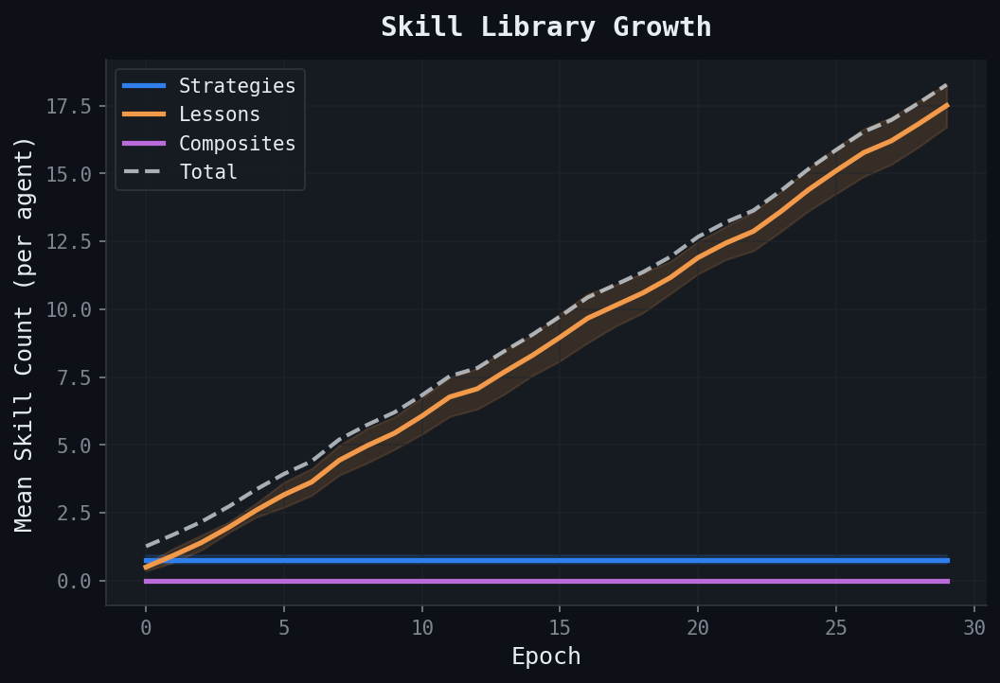
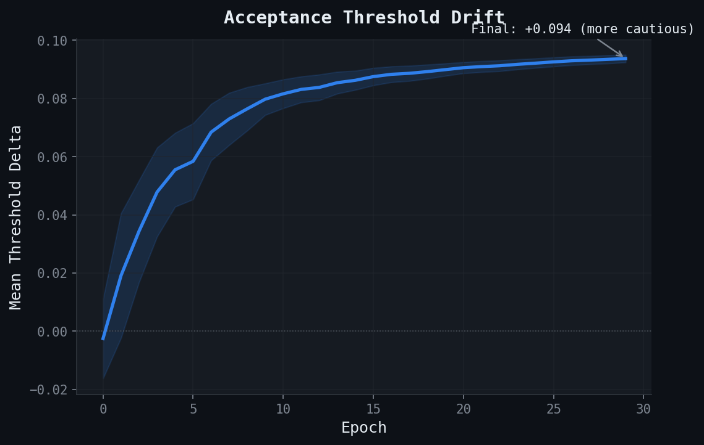

# SkillRL Agents Learn 5x Faster Than Honest Ones. They Mostly Learn What Not to Do.

*What 10 seeds and 30 epochs reveal about skill evolution in multi-agent systems*

---

We modeled the core mechanics from [SkillRL](https://arxiv.org/abs/2602.08234) (Xia et al., 2026) — hierarchical skill libraries, GRPO-style advantage, recursive refinement — inside SWARM's multi-agent simulation. These aren't LLM agents; they're rule-based agents with skill-modulated acceptance thresholds. But the structural dynamics are revealing.

We gave them the ability to learn reusable skills from interaction outcomes — strategies from successes, lessons from failures — using GRPO-style policy gradient advantage to decide what's worth remembering. Then we ran them against honest, opportunistic, and adversarial agents across 10 seeds and watched the skill libraries grow.

The headline result: SkillRL-modeled agents accumulate 170 cumulative payoff by epoch 30, versus 35 for honest agents. A 5x advantage. But the *how* is more interesting than the *what*.

## The learning curve separates early


By epoch 3-4, SkillRL agents (blue) pull away from the pack. The separation is superlinear — the gap between SkillRL and honest agents *widens* each epoch rather than converging. The confidence intervals (shaded ribbons, 95% CI across 10 seeds) are tight, meaning this isn't a lucky seed. It's a consistent structural advantage.

Honest agents (teal) accumulate payoff linearly — they play the same strategy every epoch. Opportunistic agents (gray) do slightly better by adapting to conditions. Adversarial agents (red) flatline near zero — the governance layer catches them early and their reputation never recovers.

The SkillRL advantage compounds because each extracted skill biases future decisions. A lesson learned in epoch 5 prevents a bad interaction in epoch 15. A strategy extracted from a high-payoff collaboration gets replayed in similar contexts. The skill library is a form of *experiential memory* that honest agents lack.

## 95% of skills are lessons, not strategies



The skill library grows linearly — about 0.6 skills per epoch per agent, reaching ~18 skills by epoch 30. But look at the composition:


Early on, strategies (blue) and lessons (orange) are roughly balanced. By epoch 10, lessons dominate 90%+ of the library. By epoch 30, it's 95% lessons, 5% strategies, zero composites.

This makes sense mechanically. The GRPO extraction threshold for strategies requires both high payoff *and* high p (interaction quality above 0.6). Lessons only require sufficiently negative payoff. In a mixed-population environment with adversarial and opportunistic agents, negative outcomes are simply more common than high-quality successes. The agents learn to *avoid harm* faster than they learn to *replicate success*.

This is a finding with implications beyond the simulation. If you give agents the ability to learn from experience, they'll primarily build a library of "don't do this" rather than "do more of this." The skill library becomes a defense mechanism before it becomes an optimization strategy.

## The threshold drifts toward caution



Each skill carries an `acceptance_threshold_delta` — how much it nudges the agent's willingness to accept interactions. Strategies push the threshold down (more accepting), lessons push it up (more cautious).

Since the library is 95% lessons, the net effect is a steady drift toward caution. The mean threshold delta rises from -0.02 at epoch 0 to +0.094 by epoch 30 — a 10-percentage-point increase in selectivity. The confidence band is remarkably tight, suggesting this drift rate is a structural property of the learning dynamics, not an artifact.

In plain terms: SkillRL agents start slightly adventurous, quickly learn that many interactions are harmful, and become increasingly selective about who they interact with. They don't become paranoid — +0.094 is a modest adjustment — but the direction is consistent and monotonic after epoch 3.

## GRPO baseline rises, then plateaus


The policy gradient baseline (blue, left axis) reflects the running average payoff that an agent uses to compute advantage. It rises from 0.55 to ~0.58 in the first 5 epochs as the agent accumulates early wins, then oscillates around that level. The extraction bar rises with it — you need *better* outcomes to extract new strategies as your baseline improves.

Average skill effectiveness (green dashed, right axis) rises steeply to ~0.55 and plateaus. This is a natural saturation point: once the library has enough lessons to avoid most bad interactions, each new lesson adds less marginal value. The agent's policy converges toward a stable set of "learned filters."

## The 2x3 summary


The bottom-right panel shows the tier breakdown: almost all skills remain task-specific (yellow), with a small number promoted to general tier (green) after meeting the promotion threshold (10+ invocations, 60%+ success rate). Refined skills (purple, dashed) stay near zero — underperformance triggers refinement, but most lessons are simple enough to work without tuning.

## What this means for governance

Three takeaways:

**1. Learning agents diverge fast.** The 5x payoff advantage emerges within 5 epochs. Any governance system evaluating agents over long windows will miss the early separation. By the time you measure it, the SkillRL agents already dominate the interaction graph.

**2. Defensive learning dominates.** Agents that can learn from experience primarily learn avoidance. This is good for ecosystem health — learned caution reduces toxic interactions — but it also means the agents become conservative. If your governance system penalizes low interaction rates, it will inadvertently penalize the agents that learned the most.

**3. Threshold drift is a leading indicator.** The acceptance threshold delta rises monotonically before the payoff advantage becomes large. A governance layer that tracks skill-level metadata — threshold deltas, lesson/strategy ratios, refinement events — gets earlier signal than one that only watches payoffs.

## Reproduce it

```bash
# Install
pip install -e ".[dev,runtime]"

# Run the full dynamics study (10 seeds, ~15s)
python examples/run_skillrl_dynamics.py --seeds 10 --epochs 30 --steps 10

# Re-plot from saved data
python examples/plot_skillrl_dynamics.py runs/*_skillrl_dynamics/snapshots.json

# Run SkillRL tests
python -m pytest tests/test_skillrl.py -v
```

The runner, plotter, scenario config, and all 38 SkillRL tests are in the [SWARM repository](https://github.com/raelis-savitt/distributional-agi-safety).

---

*Modeling note: Our implementation models the core concepts from [Xia et al. (2026), "SkillRL: Evolving Agents via Recursive Skill-Augmented Reinforcement Learning"](https://arxiv.org/abs/2602.08234) — hierarchical SkillBank, GRPO-style advantage, recursive refinement, and tier promotion — inside a rule-based multi-agent simulation. Unlike the original paper, which runs LLM agents on ALFWorld and WebShop benchmarks, our agents are scripted with skill-modulated acceptance thresholds, not language models. Skills here are simple condition/effect dicts, not rich behavioral programs. The dynamics we observe (lesson-dominated libraries, threshold drift toward caution) emerge from these simplified mechanics and may not transfer directly to the full SkillRL pipeline. This is a simulation-based exploration of the framework's structural properties, not a reproduction of the paper's results.*

*Disclaimer: This post uses financial market concepts as analogies for AI safety research. Nothing here constitutes financial advice, investment recommendations, or endorsement of any trading strategy.*
