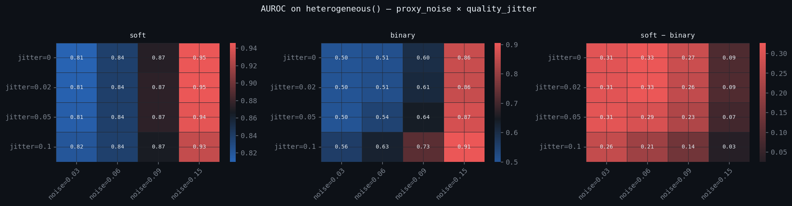

# Keep the Probability: When Soft Labels Beat Binary Thresholds at Catching Degrading Agents

*Keep the probability — don't collapse it to a pass/fail bit. We turned the "soft metrics flagged it" vignette — a self-optimizing agent that games its benchmark while its true quality quietly decays — into a head-to-head detection experiment, scoring every soft metric against its thresholded twin on identical data. A threshold counter is blind by construction to degradation that stays above the bar; the soft detector reads the shift in the full quality distribution. The soft advantage is real but conditional: biggest (~+0.3 AUROC) exactly where the quality signal is clean, narrowing as observation noise grows. And at a matched false-positive budget, soft flags degrading agents in ~2 epochs to binary's ~10 — catching all of them where binary misses 12%.*

---

We've argued for a while that probabilistic (soft) labels beat binary good/bad classifications for catching agents whose quality is quietly drifting downward. Until now that claim lived in a narrative — a vignette about a self-optimizing agent that keeps passing its benchmark while its real output quality decays. A vignette is not evidence. So we built the experiment.

The setup is a head-to-head: every soft metric is paired with its **binary analogue** — the *same* metric computed on the proxy thresholded at τ\*=0.50 — and both detectors are scored as real classifiers on identical interaction streams. We report AUROC, **AUPRC** (critical in imbalanced settings), partial AUROC at low FPR, time-to-detection at fixed FPR, market-level selection signals, and calibration. Same data, same metric definition, the only difference is whether you keep the full probability `p` or collapse it to a 0/1 at the threshold.

## The degrading-agent model

The generative model carries two signals per interaction, and the gap between them is the whole point:

- **`benchmark`** — the screening signal acceptance is based on. A self-optimizing agent *games* this: it keeps the benchmark high regardless of falling quality, so its interactions keep getting accepted.
- **`p`** — the true-quality proxy. For a degrading agent this drifts downward, but it **stays above the binary threshold**. The quality floor sits above τ\*=0.50.

That second property is what makes the detection problem interesting. A threshold-counting detector watches interactions keep clearing the bar and sees almost nothing. Only the shift in the full quality *distribution* — which the soft label preserves and the threshold throws away — reveals the degradation.

We run this in two regimes: a *realistic* one with heterogeneous agents and an uncertain degradation floor (the headline results below), and an *easy* baseline with a homogeneous population (which we use to expose a measurement artifact at the end). Both sweep multiple adversarial base rates and seeds, with degradation trajectories (linear / exponential / step / sigmoid) and onset times varied across agents.

## Result 1: Soft beats binary — but only where the signal is clean

The honest test is a regime where detection is a genuine statistical problem: benign agents that *vary* in quality (so their lower tail overlaps mildly-degraded ones) and a per-agent, *uncertain* degradation floor (so some agents barely degrade). There the per-agent toxicity detector produces a real response surface — not a wall of perfect scores. Here is AUROC across observation noise (`proxy_noise`) and per-epoch quality jitter, for soft, binary, and their difference:



Soft AUROC lands in a genuine **0.81–0.95**; binary ranges from **0.50** (blind) to **0.91**. Sweeping observation noise at fixed `quality_jitter = 0` (the top row of the heatmap):

| proxy_noise | soft AUROC | binary AUROC | gap |
| --- | ---: | ---: | ---: |
| 0.03 | 0.810 | 0.500 | +0.310 |
| 0.06 | 0.837 | 0.510 | +0.327 |
| 0.09 | 0.872 | 0.599 | +0.273 |
| 0.15 | 0.946 | 0.860 | +0.086 |

Three things stand out:

- **The soft advantage is real but *conditional*.** It's largest (~+0.31 AUROC) exactly in the clean-signal regime — low observation noise — which is the operating point a mature monitoring system aims for, and where binary is near-blind (AUROC 0.50, AUPRC ≈ base rate). As observation noise rises, binary "catches up" (enough quality mass finally crosses τ\*=0.50) and the gap shrinks to +0.03–0.09. **Keep the probability** matters most precisely where your signal is good.
- **`proxy_noise` is the dominant axis.** Both detectors improve left-to-right; the soft–binary gap is governed mostly by how much observation noise blurs the threshold.
- **A subtle interaction the easy regime can't show:** per-epoch quality *jitter* **helps the binary detector** (rightmost panel, lower rows) — it widens the distribution so more degrading interactions dip below the threshold — while being roughly neutral for soft.

Reproduce the full `proxy_noise × quality_jitter` grid with one flag:

```bash
PYTHONPATH=. python experiments/run_detection_sensitivity_2d.py --preset heterogeneous
```

(The naive run on the *default* generator pins soft at a perfect AUROC 1.00 — that's a ceiling of the model, not a result. We unpack why at the end.)

## Result 2: Time-to-detection — 2 epochs vs 10

The more operationally useful question isn't "can you eventually tell them apart" but "how fast." We calibrate each detector to a fixed false-positive rate (FPR ≤ 0.05) on benign agents, then measure epochs-from-onset until it flags a degrading one.

| variant | median epochs from onset | detection rate |
| --- | ---: | ---: |
| binary | 9.93 | 0.88 |
| soft | 2.13 | 1.00 |


At the same false-positive budget, the soft detector flags degradation in about **2 epochs and catches 100% of degrading agents**. The binary detector takes nearly **10 epochs and misses 12% of them entirely** — those are the agents whose gamed benchmark keeps them above the threshold long enough that the trailing-window count never crosses the alarm line.

> A note on rigor: an earlier version of this measurement scanned for detections over a wider epoch window than the one the FPR threshold was calibrated on, which let pre-onset windows artificially deflate the soft TTD (we'd reported 0.28 epochs). After aligning the scan and calibration windows — [flagged in review on the PR](https://github.com/swarm-ai-safety/swarm/pull/450) — the honest figure is 2.13 epochs. Still a ~5× speedup, just not a magic one.

## Result 3: Market-level adverse selection

Toxicity and uncertain_fraction are per-agent detectors. Quality-gap, conditional-loss, and **spread** are **selection** metrics — they compare accepted vs rejected interactions across a quality mixture, so they're only well-posed at the market level. The runner now reports all of them automatically.

The soft versions read a real adverse-selection signal; the binary versions flatten to noise:

| metric | variant | br=0.05 | br=0.10 | br=0.20 | br=0.35 | br=0.50 |
| --- | --- | ---: | ---: | ---: | ---: | ---: |
| quality_gap | soft | −0.106 | −0.100 | −0.085 | −0.066 | −0.048 |
| quality_gap | binary | 0.000 | 0.001 | 0.001 | 0.004 | 0.003 |
| conditional_loss | soft | −0.021 | −0.019 | −0.015 | −0.011 | −0.007 |
| conditional_loss | binary | 0.000 | 0.000 | 0.000 | 0.001 | 0.000 |
| spread | soft | −0.043 | ... | −0.031 | ... | −0.015 |
| spread | binary | −0.001 | ... | −0.000 | ... | 0.000 |


The soft quality-gap and spread are consistently negative (the signature of adverse selection), strongest in the rare-adversary regime. Their binary twins read ~0.00 everywhere: once you threshold, accepted and rejected look identical because the gamed agents all sit on the "accept" side of the line. The detection framework now automatically includes `spread` alongside the original two selection metrics.

## Result 4: Calibration

Finally, how much predictive resolution does thresholding actually destroy? We score the soft probability `p` against ground-truth outcomes versus its hard-thresholded twin `1{p ≥ τ\*}`:

| | Brier | ECE |
| --- | ---: | ---: |
| soft | 0.151 | 0.054 |
| binary | 0.183 | 0.183 |


The binary prediction's expected calibration error equals its Brier-style miss because a 0/1 prediction is maximally overconfident — it claims certainty it doesn't have. The soft probability stays well-calibrated (ECE 0.054).

## A note on the easy regime: why the naive numbers say "AUROC 1.00"

Run the same experiment on the *default* (homogeneous) generator — every benign agent pinned to one quality, a fixed degradation floor — and the soft toxicity detector scores a perfect **AUROC = 1.000 at every base rate**, with binary trailing at ~0.91–0.96:

| base rate | soft AUROC | binary AUROC |
| --- | ---: | ---: |
| 0.05 | 1.000 ± 0.000 | 0.925 ± 0.115 |
| 0.10 | 1.000 ± 0.000 | 0.950 ± 0.061 |
| 0.20 | 1.000 ± 0.000 | 0.912 ± 0.064 |
| 0.35 | 1.000 ± 0.000 | 0.964 ± 0.036 |
| 0.50 | 1.000 ± 0.000 | 0.945 ± 0.040 |

We deliberately *don't* lead with this. Those 1.000s are a **ceiling of the generator, not a measure of detection power**: with benign agents pinned to a single quality and ~50–100 interactions averaged per agent, the two classes are separated by ~7.8 standard deviations (d′ ≈ 7.8) and never overlap, so AUROC ≈ 1.0 is a near-mathematical certainty. The same ceiling shows up in **AUPRC** — at a 5% base rate soft sits at 1.000 while binary collapses toward ~0.37, directionally real (thresholding hurts most when positives are rare) but with a saturated soft endpoint. What survives de-saturation is the *direction* and *mechanism* (a threshold detector's benign score is literally 0.000 because nothing crosses τ\*=0.50) and the *noise-dependence* in Result 1 — not the absolute 1.00. Stress tests and what a genuine power test requires: [`docs/notes/detection_soft_ceiling_caveat.md`](../notes/detection_soft_ceiling_caveat.md).

## Why this matters

The takeaway isn't that soft labels are better in the abstract. It's that the **specific failure mode of modern self-optimizing agents — gaming the acceptance signal while real quality decays — is invisible to threshold-counting detectors by construction**, and visible to distributional ones.

And it's conditional in a way that *favors* good monitoring: the soft edge is largest exactly where the quality signal is clean and low-noise — the regime a mature system works to reach — and narrows only as observation noise washes the threshold out. If your safety monitoring collapses a calibrated probability to a pass/fail bit, you are throwing away exactly the signal that catches the agents you most want to catch, in the regime where you could most easily have caught them — and you find out ~5× slower when you do.

Everything here is reproducible:

```bash
PYTHONPATH=. python experiments/run_detection_experiment.py          # 5 base rates × 10 seeds
PYTHONPATH=. python experiments/run_detection_experiment.py --smoke  # quick
```

The runner now automatically produces tables for:
- AUROC by base rate
- **AUPRC** (Area Under the Precision-Recall Curve)
- Partial AUROC at low FPR (FPR ≤ 0.05 and 0.01)
- Time-to-detection at calibrated FPR
- Market adverse selection (including `spread`)
- Calibration

The full detection module (`swarm/detection/`), matched detectors (toxicity + uncertain_fraction per-agent; quality_gap + conditional_loss + spread at market level), generative model, and tests landed in [PR #450](https://github.com/swarm-ai-safety/swarm/pull/450). Subsequent improvements (pAUROC + proper AUPRC surfacing, plus the `spread` and `uncertain_fraction` matched detectors and a 2D sensitivity-grid runner) landed in [PR #453](https://github.com/swarm-ai-safety/swarm/pull/453).

---

*Disclaimer: This post uses financial market concepts as analogies for AI safety research. Nothing here constitutes financial advice, investment recommendations, or endorsement of any trading strategy.*
