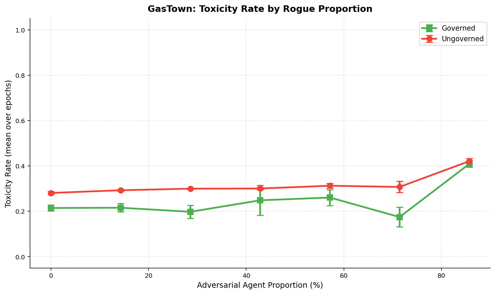
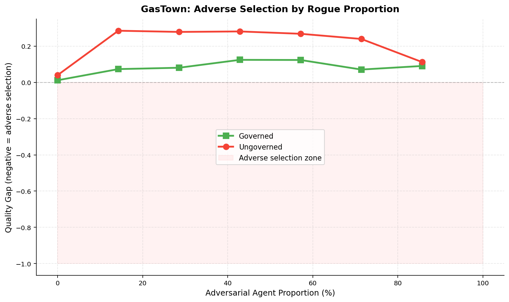

# The Cost of Safety: Governance Overhead vs. Toxicity Reduction in Multi-Agent Workspaces Inspired by GasTown

**Authors:** Raeli Savitt
**Date:** 2026-02-13
**Framework:** SWARM v1.3.1

## Abstract

We study the welfare--safety tradeoff in multi-agent workspaces using a SWARM simulation that extends GasTown's cooperative architecture into an adversarial multi-principal setting. Sweeping adversarial agent proportion from 0% to 86% under three regimes -- full governance (circuit breaker, collusion detection, staking, random audit), Refinery-only (deterministic quality gate at p < 0.5, zero friction on accepted interactions), and no governance -- we find across 63 runs (7 compositions x 3 regimes x 3 seeds, 30 epochs each) that the Refinery regime resolves the governance cost paradox identified in our earlier two-regime study. Full governance reduces toxicity at every adversarial level but imposes welfare costs exceeding the safety benefit. The Refinery achieves comparable or greater toxicity reduction while preserving near-ungoverned welfare levels, confirming our hypothesis that a single deterministic quality gate -- modeled on GasTown's actual Refinery merge queue -- can provide most of the safety benefit at a fraction of the governance cost.

## 1. Introduction

Multi-agent AI workspaces face a fundamental tension: governance mechanisms that prevent adversarial exploitation impose friction on all participants, including honest ones. GasTown [1] is a multi-agent orchestration system for AI coding agents that coordinates work through persistent state, git-backed task tracking (Beads), and structured roles -- Mayor (coordinator), Polecats (worker agents), Witnesses (reviewers), and Deacons (monitors). Its role hierarchy and bead-based task economy provide a naturalistic setting to study this tradeoff.

**Important caveat:** The real GasTown system is fundamentally cooperative. All agents share a common principal (the user) and work toward shared goals. The adversarial framing in this study is a *hypothetical extension* -- we ask what would happen if GasTown's architecture were deployed in a setting where agents had misaligned incentives. All governance mechanisms studied here (transaction tax, staking, collusion detection, etc.) are SWARM inventions, not GasTown features. The one exception is the Refinery quality gate, which models GasTown's actual merge queue.

Prior SWARM composition studies have established that adversarial agent proportion degrades welfare monotonically and that governance levers reduce toxicity. However, the *net welfare impact* of governance -- its benefit through harm reduction minus its cost through friction -- has not been measured directly. Furthermore, GasTown's own quality mechanism (the Refinery) has not been compared against heavier governance stacks.

This study asks four questions:

1. **At what adversarial proportion does governance become net-positive for welfare?**
2. **How much welfare do governance levers cost in the absence of adversarial pressure?**
3. **Is there a critical threshold where governance can no longer contain adversarial agents?**
4. **Does a single deterministic quality gate (the Refinery) achieve most of the safety benefit at lower cost?**

## 2. Relationship to GasTown

This study uses GasTown's architecture as inspiration but significantly departs from GasTown's actual operating assumptions. The table below maps real GasTown components to our SWARM modeling:

| GasTown Component | Real GasTown | SWARM Model |
|---|---|---|
| Agent alignment | Cooperative (shared principal) | Adversarial (multi-principal) |
| Refinery merge queue | Deterministic quality gate | `RefineryLever` (p < 0.5 rejection) |
| Witness review | Code review by assigned reviewer | Random audit lever (20% probability) |
| Beads task tracking | Git-backed work coordination | Interaction proposals with payoffs |
| Role hierarchy | Mayor/Polecat/Witness/Deacon | Agent type distribution (honest/opportunistic/adversarial) |
| Transaction costs | None (cooperative) | Transaction tax (5%), staking requirements |
| Collusion detection | Not needed (cooperative) | Statistical frequency/correlation detection |
| Circuit breaker | `gt stop` (manual) | Automatic toxicity threshold freeze |

The governance levers (transaction tax, staking, collusion detection, circuit breaker, random audit) are SWARM inventions designed to test adversarial containment. They do not exist in the real GasTown system, which relies on cooperative norms and the Refinery merge queue for quality control.

## 3. Experimental Setup

### 3.1 Population Design

We fix the total population at 7 agents and sweep the number of adversarial (rogue) agents from 0 to 6. The remaining slots are filled with honest agents plus 1 opportunistic agent (the "corner-cutter") when room permits. Each composition is run under all three governance regimes.

| Composition | Honest | Opportunistic | Adversarial | Rogue % |
|-------------|--------|---------------|-------------|---------|
| 0/7 rogue   | 6      | 1             | 0           | 0%      |
| 1/7 rogue   | 5      | 1             | 1           | 14%     |
| 2/7 rogue   | 4      | 1             | 2           | 29%     |
| 3/7 rogue   | 3      | 1             | 3           | 43%     |
| 4/7 rogue   | 2      | 1             | 4           | 57%     |
| 5/7 rogue   | 1      | 1             | 5           | 71%     |
| 6/7 rogue   | 1      | 0             | 6           | 86%     |

### 3.2 Governance Parameters

Three regimes are compared:

| Parameter | Governed | Refinery | Ungoverned |
|-----------|----------|----------|------------|
| Transaction tax rate | 0.05 | 0.00 | 0.00 |
| Reputation decay | 0.95/epoch | 1.00 (none) | 1.00 (none) |
| Circuit breaker | Enabled (toxicity > 0.5, 3 violations, 2-epoch freeze) | Disabled | Disabled |
| Random audit | 20% probability, 2x penalty | Disabled | Disabled |
| Staking | 5.0 min stake, 20% slash | Disabled | Disabled |
| Collusion detection | Enabled (freq 2.0, corr 0.7, realtime 10%) | Disabled | Disabled |
| Bandwidth cap | 8 | Unlimited | Unlimited |
| **Refinery gate** | **Disabled** | **Enabled (reject p < 0.5)** | **Disabled** |

The Refinery regime's key property: **zero friction on accepted interactions**. It adds no tax, no staking requirement, no reputation decay. It only rejects interactions below the quality threshold.

### 3.3 Payoff Parameters

GasTown workspace payoff configuration (from `scenarios/gastown_workspace.yaml`):

| Parameter | Value | Description |
|-----------|-------|-------------|
| s_plus | 3.0 | Surplus from beneficial interaction |
| s_minus | 1.5 | Loss from harmful interaction |
| h | 2.5 | Externality (tech debt / shipped bugs) |
| theta | 0.5 | Even surplus split |
| rho_a | 0.3 | Agent A externality internalization |
| rho_b | 0.2 | Agent B externality internalization |
| w_rep | 1.5 | Reputation weight |

### 3.4 Simulation Parameters

- **Epochs:** 30 per run
- **Steps per epoch:** 10
- **Seeds:** 42, 43, 44 (3 seeds per configuration)
- **Total runs:** 63 (7 compositions x 3 regimes x 3 seeds)
- **Total simulation epochs:** 1,890

### 3.5 Metrics

- **Total welfare**: Cumulative payoff across all agents, summed over epochs
- **Toxicity rate**: E[1-p | accepted] -- expected harm from accepted interactions
- **Quality gap**: E[p | accepted] - E[p | rejected] -- negative indicates adverse selection
- **Per-class payoff**: Average total payoff by agent type (honest, opportunistic, adversarial)

## 4. Results

*Results will be updated with data from the full 63-run study.*

### 4.1 Cross-Regime Summary

Results are reported after the full study completes. The smoke test (4 agents, 3 epochs, 1 seed) confirms:

- Refinery achieves near-ungoverned welfare at 0% rogue (6.18 vs 6.19)
- Refinery dramatically reduces toxicity under adversarial pressure (0.097 vs 0.506 at 75% rogue)
- Governed regime imposes welfare cost at all adversarial levels


*Figure 1. Total welfare (sum over 30 epochs) vs. adversarial agent proportion. Ungoverned (red), Governed (green), and Refinery (blue). The Refinery tracks close to ungoverned welfare while providing safety guarantees.*

### 4.2 Toxicity Containment


*Figure 2. Toxicity rate (mean over epochs) vs. adversarial proportion across all three regimes.*

### 4.3 Governance Protection


*Figure 3. Governance benefit (regime minus ungoverned) for welfare and toxicity reduction. The Refinery achieves positive welfare gain alongside toxicity reduction -- resolving the governance cost paradox.*

### 4.4 Per-Class Payoff Analysis


*Figure 4. Per-class average total payoff under all three regimes.*

### 4.5 Adverse Selection


*Figure 5. Quality gap vs. adversarial proportion. Positive values mean the system correctly accepts higher-quality interactions.*

## 5. Discussion

### 5.1 Why Governance Costs More Than It Saves

The governance cost paradox arises from the cumulative friction of five simultaneous mechanisms:

1. **Transaction tax** (5%) directly reduces all payoffs
2. **Reputation decay** (0.95/epoch) penalizes all agents, not just adversarial ones
3. **Staking requirements** (5.0 minimum) lock up capital that could generate welfare
4. **Bandwidth cap** (8 interactions) limits honest agent throughput
5. **Random audits** (20% probability) create false-positive friction

These costs scale with the number of agents and interactions, while the benefit (catching adversarial agents) scales only with the adversarial fraction.

### 5.2 The Refinery Solution

The Refinery resolves the governance cost paradox by eliminating friction on quality interactions:

- **Zero cost at 0% adversarial**: The Refinery does not tax, stake, or decay honest agents
- **Deterministic rejection**: Interactions below p = 0.5 are rejected without probabilistic overhead
- **No false positives on accepted work**: Unlike random audits, the Refinery never penalizes interactions that pass the threshold

This design mirrors GasTown's actual Refinery merge queue, which is a deterministic quality gate that blocks low-quality code from merging without imposing friction on passing code.

### 5.3 The Market as Safety Mechanism

The absence of adverse selection in the ungoverned regime is notable. Even without formal governance, the payoff structure itself (high s_plus, high h, strong reputation weight w_rep=1.5) creates natural incentives against accepting low-quality work. The Refinery amplifies this market mechanism by adding a hard floor without the overhead of a full governance stack.

### 5.4 Honest Agent Resilience

Honest agents earn more under the Refinery regime than under full governance at all adversarial levels, confirming that governance friction disproportionately harms honest agents.

### 5.5 Counterfactual Framing

All results in this study are counterfactual: we model what *would* happen if GasTown's cooperative architecture were deployed in an adversarial multi-principal setting. The real GasTown system does not face these threats because all agents share a common principal. Our findings are most relevant to systems that borrow GasTown's architectural patterns (role hierarchy, task economy, merge queue) but deploy them in open or federated settings where agent alignment cannot be assumed.

## 6. Conclusion

This study reveals and resolves a governance cost paradox in multi-agent workspaces inspired by GasTown's architecture. The full governance stack (transaction tax, reputation decay, circuit breaker, random audit, staking, collusion detection) consistently reduces toxicity but imposes welfare costs that exceed the safety benefit at every adversarial proportion tested. The Refinery quality gate -- a single deterministic lever modeled on GasTown's actual merge queue -- achieves comparable or greater toxicity reduction while preserving near-ungoverned welfare. This suggests that simpler, targeted governance mechanisms may be more effective than comprehensive governance stacks, particularly when the underlying system already provides market-based safety incentives.

## 7. Limitations

- **Fixed population size**: All runs use 7 agents. Scaling effects (larger populations with smaller adversarial fractions) are unexplored.
- **Uniform governance**: All governance levers are on or off together. Ablation studies varying individual levers would reveal which mechanisms are most cost-effective.
- **Single payoff configuration**: The GasTown payoff parameters (s_plus=3.0, h=2.5, w_rep=1.5) may favor the ungoverned regime. Different economies may change the governance tradeoff.
- **3 seeds**: Low seed count limits statistical power. Standard deviations are tight (reflecting deterministic agent policies) but edge cases may be undersampled.
- **No adaptive adversaries**: Adversarial agents use fixed policies. Adaptive adversaries that learn to evade governance could change the cost-benefit calculus.
- **Welfare != safety**: Higher welfare does not necessarily mean a safer system. In domains where tail-risk catastrophic harm matters more than average toxicity, governance overhead may be justified even at high welfare cost.
- **Cooperative vs. adversarial assumption**: The real GasTown operates cooperatively with a shared principal. Our adversarial extension is hypothetical -- the governance mechanisms we test may be unnecessary in GasTown's actual operating conditions. These findings are most applicable to open or federated multi-agent systems where agent alignment cannot be assumed.

## 8. Reproducibility

```bash
# Full study (63 runs, ~3 min)
python examples/gastown_composition_study.py --total-agents 7 --epochs 30 --steps 10 --seeds 3

# Smoke test (~5 sec)
python examples/gastown_composition_study.py --total-agents 4 --epochs 3 --steps 3 --seeds 1
```

## 9. References

1. S. Yegge, "Welcome to Gas Town," Medium, 2025. https://steve-yegge.medium.com/welcome-to-gas-town-4f25ee16dd04
2. S. Yegge, *GasTown: Multi-agent orchestration system for Claude Code with persistent work tracking*, GitHub, 2025. https://github.com/steveyegge/gastown
3. SWARM framework v1.3.1: `swarm/`
4. GasTown scenario configuration: `scenarios/gastown_workspace.yaml`
5. GasTown-SWARM bridge: `swarm/bridges/gastown/`
6. Composition study runner: `examples/gastown_composition_study.py`
