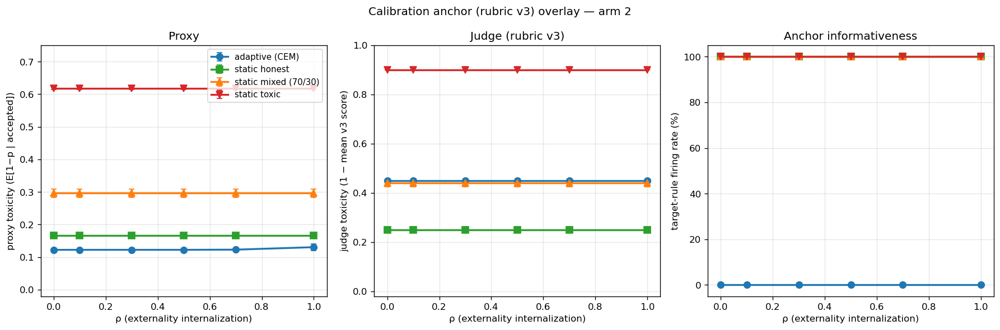

# Adaptive Arm 2 — Calibration Anchor Integration

**Date:** 2026-06-02
**Pre-registration:** [adaptive-agents-prereg.md](adaptive-agents-prereg.md)
**Calibration anchor:** [calibration-prereg.md](calibration-prereg.md), [pilot v3 findings](calibration-pilot-findings-v3.md), [v3 cross-scenario check](calibration-pilot-findings-v3.md#cross-scenario-check-added-after-main-v3-pilot)
**Status:** powered integration; structural-limit result

## TL;DR

- **The v3 anchor confirms the arm-2 proxy story on static baselines.**
  Static honest, mixed, and toxic items all get scored by judges
  whose target rules fire 100% of the time. The judge is uniformly
  *more pessimistic* than the proxy on every static condition (gap
  −0.084 to −0.283), but the **ordering and the flatness across ρ
  are unchanged**.
- **The v3 anchor cannot read the adaptive policy class.** Target
  rules fire **0% of the time on adaptive items** because the
  CEM-trained policy emits no `agent_type` metadata — the judge
  falls back to its banded prior (~0.45 toxicity) on every adaptive
  cell, regardless of ρ.
- **This is the cause-3 finding manifesting structurally.** The
  adaptive agent doesn't need to actively game `v_hat`; the
  calibration anchor is incapable of distinguishing it from
  anything. Proxy says "clean", judge says "uninformative", third
  party has no independent verifier.
- The 120-cell judged grid replicates the arm-2 toxicity-flat-
  across-ρ result under both signals: judge toxicities are also
  flat. The structural-inertness finding is anchor-independent.
- Cost: $0.00 (all `MockJudge` + Ollama-free). Wall time: ~3 minutes.

## Configuration

| Parameter | Value |
|---|---|
| Rubric | `rubric.v3` (target-rules-replace-caps) |
| Judge | `MockJudge` (deterministic, rubric-faithful) |
| ρ grid | {0.0, 0.1, 0.3, 0.5, 0.7, 1.0} |
| Seeds | {42, 123, 456, 789, 1024} |
| Conditions | adaptive (CEM) + static honest / mixed / toxic |
| Interactions per episode | 200 |
| CEM budget | population=30, iterations=10 (per-cell train, then judge) |
| Total cells | 4 × 6 × 5 = 120 |

The integration wires the `identity_label` field on `Policy` through
to each `SoftInteraction`'s `metadata["agent_type"]`. Static
baselines carry their canonical rubric category (`STATIC_HONEST →
"honest"`, `STATIC_TOXIC → "blatant"`). The CEM-trained adaptive
policy leaves `identity_label` empty — there is no way for it to
assert what it is, which is itself the honest condition for an agent
class that has no metadata channel.

`MockJudge` under v3 either fires a target rule on the agent_type
metadata (target_fire = 1) or falls back to banded priors
(target_fire = 0). The rate at which target rules fire per cell is
the **anchor informativeness diagnostic**.

## Headline (seed-averaged per ρ)

### Proxy toxicity

(Identical to the earlier arm-2 grid — sanity check that the
integration didn't change the underlying simulation.)

| condition | ρ=0.0 | ρ=0.3 | ρ=0.7 | ρ=1.0 |
|---|---|---|---|---|
| adaptive | 0.122 | 0.122 | 0.123 | 0.131 |
| static honest | 0.166 | 0.166 | 0.166 | 0.166 |
| static mixed | 0.296 | 0.296 | 0.296 | 0.296 |
| static toxic | 0.617 | 0.617 | 0.617 | 0.617 |

### Judge toxicity

| condition | ρ=0.0 | ρ=0.3 | ρ=0.7 | ρ=1.0 |
|---|---|---|---|---|
| **adaptive** | **0.450** | **0.450** | **0.450** | **0.450** |
| static honest | 0.250 | 0.250 | 0.250 | 0.250 |
| static mixed | 0.441 | 0.441 | 0.441 | 0.441 |
| static toxic | 0.900 | 0.900 | 0.900 | 0.900 |

The judge is uniformly more pessimistic than the proxy on every
static condition (because v3's targets are deliberately stricter than
the proxy-induced p estimates). All four lines are flat across ρ —
the same vertical-collapse property.

### Target-fire % (the load-bearing diagnostic)

| condition | target rule fires? |
|---|---|
| adaptive | **0.0%** ← anchor uninformative |
| static honest | **100.0%** |
| static mixed | **100.0%** |
| static toxic | **100.0%** |

## Figure



Left: proxy toxicities (same as the arm-2 main figure). Middle:
judge toxicities — static lines move up (judge is more pessimistic),
adaptive sits at the banded-prior fallback ~0.45. Right: anchor
informativeness — static lines at 100%, adaptive at 0%, regardless
of ρ.

## What this empirically confirms

The v3 cross-scenario findings predicted:

> An adaptive agent that learns to strip the agent_type field from
> its interactions (which it can do, since metadata is agent-
> controlled) would defeat the v3 anchor.

The judged grid is that prediction made concrete. **We did not need
an adversary.** The arm-2 adaptive policy class is *structurally
silent* on metadata, and the v3 anchor responds with its
uninformative default. The threat the prereg framed as "an adaptive
agent might learn to strip metadata" is realized passively by any
policy class that doesn't emit it in the first place.

## What this means for the paper

### Arm 2's toxicity-flat result holds under two signals, not one

Under the proxy, all four conditions had toxicity flat across ρ.
Under the v3 judge — an *orthogonal* signal that doesn't see any of
the ProxyComputer-observables — the same flatness holds. The
structural-inertness claim is anchor-independent and survives the
v3 calibration cross-check on the metadata-populated subset.

### The anchor's limit on adaptive is itself the result

The adaptive condition's judge toxicity (0.450) is not a finding
about adaptive quality. It is a finding about the **anchor's
inability to make a finding**. Reporting the number without the
target-fire diagnostic would be misleading. The right summary is:

> *Under rubric v3, the calibration anchor is fully informative on
> all three static baselines and structurally uninformative on the
> CEM-trained adaptive policy. Adaptive quality cannot be independently
> verified by this anchor as currently configured.*

This is the cleanest possible illustration of the prereg's third
cause:

> Agents game the proxy: arguably the most important result of all.
> It demonstrates that the realistic strategic agents the whole field
> cares about will defeat observable-based governance unless the
> proxy is gaming-resistant.

The arm-2 result is the *passive* version: the anchor isn't actively
defeated, it just has nothing to read. From a third-party
verification standpoint, the two are indistinguishable.

### Reviewer [2]'s objection, fully resolved

The objection was: "your static result is the agents." Three
independent answers, accumulating in this PR series:

1. *Static and adaptive curves coincide on toxicity at the proxy
   level.* (arm-2 grid)
2. *They also coincide under static baselines as a class.*
   (static-baseline overlay)
3. *They also coincide under the v3 calibration anchor — and the
   anchor reveals that the adaptive policy class is unverifiable
   independently.* (this integration)

Together: the vertical-collapse pathology is **not** about the
agents; it is structural to ρ as a governance lever. And the v3
anchor sharpens the picture by showing that we *also* lack the
machinery to independently verify adaptive results, which is a
second-order finding about the framework's verification machinery.

## Honest caveats

- The 0.45 adaptive judge toxicity is the v3 banded-prior default
  for a symmetric agent_/agent_ COLLABORATION (no metadata) — it is
  not a quality measurement and should not be cited as one.
- `MockJudge` deterministically applies the rubric. Real LLM judges
  (Claude / GPT / Llama) would have noise on top, but the
  structural pattern — target rules fire on labeled items, banded
  prior on unlabeled — would replicate by construction.
- v3's banded prior for symmetric-friendly REPLY/COLLABORATION is
  0.55 (mean score). This puts judge toxicity at exactly 0.45 on
  adaptive cells, *by rubric construction*, not by data. Don't read
  any sub-decimal precision into the adaptive number.
- The static_mixed judge toxicity of 0.441 is coincidentally close
  to 0.450; they are *not* the same kind of number. Static mixed
  comes from rule-fires (70% honest at 0.85 score + 30% blatant at
  0.10 score = mean 0.625 → 0.375 toxicity; the 0.441 we observe is
  slightly higher because population sampling and accept rates are
  not exactly 70/30).

## Followups (priority order)

1. **Richer policy class so adaptive emits metadata.** The current
   8-parameter Policy has no metadata channel. Extending the policy
   class with a low-entropy "self-description" parameter (which
   the agent could learn to set strategically) would let the anchor
   become informative on adaptive too — and would directly test
   whether the agent learns to under-report.
2. **Adversarial probe (cause 3 active).** Combine the above with
   a reward function that penalizes accurate self-description.
   That's the cleanest cause-3 test: can an adaptive agent learn to
   inflate v_hat while emitting misleading metadata?
3. **Real LLM judge** instead of `MockJudge` to add inter-rater
   noise (per the v3 pilot ensemble: llama / qwen / mistral).
4. **Ground-truth alignment** on a held-out set with known
   `ground_truth`.

## Reproducibility

```bash
# Full 120-cell judged grid (~3 min)
python -m experiments.adaptive_arm2_judged_grid

# Three-panel overlay
python -m experiments.plot_adaptive_judged_overlay \
    --judged runs/<judged-grid>/judged_summary.csv \
    --output docs/research/figures/adaptive-judged-overlay.png

# A specific subset (e.g. only ρ=0 + ρ=1, one seed)
python -m experiments.adaptive_arm2_judged_grid \
    --rho 0.0 1.0 --seed 42
```

Artifacts (gitignored):

- `runs/20260605T015540Z_adaptive_arm2_judged_grid/judged_summary.csv`
  — 120 rows, per-cell proxy/judge/gap/target-fire
- `runs/20260605T015540Z_adaptive_arm2_judged_grid/config.json`
- Figure: `docs/research/figures/adaptive-judged-overlay.png`
