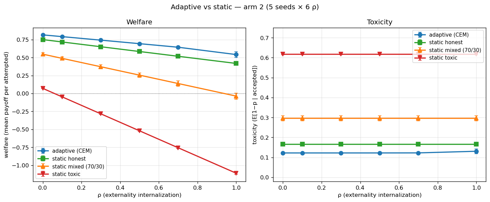

# Adaptive vs Static Overlay — Arm 2 (n=5 seeds × 6 ρ × 4 conditions)

**Date:** 2026-06-02
**Pre-registration:** [adaptive-agents-prereg.md](adaptive-agents-prereg.md)
**Previous:** [adaptive-arm2-grid-findings.md](adaptive-arm2-grid-findings.md)
**Status:** powered overlay; primary deliverable for arm 2

## TL;DR

- **Toxicity is flat across ρ in every condition.** Adaptive at 0.122,
  static honest at 0.166, static mixed at 0.296, static toxic at 0.617
  — all constant with ρ. The vertical-collapse pathology is structural
  to ρ as a governance lever in this framework, **not** an artifact
  of non-adaptive agents.
- **Adaptive welfare dominates every static condition at every ρ.**
  Even where the static-honest population would have been
  unanimously prosocial, the CEM-trained adaptive agent extracts more
  welfare from the same payoff function.
- **Adaptive achieves lower toxicity than static-honest** (0.122 vs
  0.166), but this is **channel-1 improvement from CEM training, not
  from ρ**. The agent finds a higher-quality policy than the
  canonical scripted honest one; ρ does not push it further.
- The figure-4 visual ("vertical welfare collapse, toxicity
  unchanged") replicates exactly under static and reproduces under
  adaptive — just shifted up. Reviewer [2]'s objection now has a
  data-backed answer: the static result is not an artifact, the
  pathology is structural.

## Configuration

Same pre-registered grid for both sides:

| Parameter | Value |
|---|---|
| ρ grid | {0.0, 0.1, 0.3, 0.5, 0.7, 1.0} |
| Seeds | {42, 123, 456, 789, 1024} |
| Interactions per episode | 200 |
| Adaptive | CEM, pinned `mean_attempted` reward, pre-reg budget |
| Static conditions | `honest`, `toxic`, `mixed` (70/30 honest/toxic) |
| Total cells | 4 conditions × 6 ρ × 5 seeds = 120 |

## Figure



Left panel: welfare collapses linearly with ρ for every condition,
with slope proportional to baseline toxicity (static toxic loses
the most welfare per unit ρ because it has the highest harm-rate to
tax). Adaptive sits above static-honest at every ρ.

Right panel: **all four toxicity lines are flat.** The vertical-
collapse pathology is structural — ρ does not move toxicity for any
agent class. Adaptive (blue, ~0.122) beats static honest (green,
~0.166) on the y-axis, but the gap is constant across ρ; it is a
CEM-training improvement, not a lever effect.

Error bars are 1σ across 5 seeds. They are barely visible because
seed-variance is small (~0.003 on toxicity, ~0.01 on welfare).

## Headline overlay (seed-averaged)

### Welfare (`mean_payoff_attempted`)

| ρ | adaptive | static_honest | static_mixed | static_toxic |
|---|---|---|---|---|
| 0.0 | **0.816** | 0.751 | 0.548 | 0.071 |
| 0.1 | **0.792** | 0.718 | 0.489 | −0.048 |
| 0.3 | **0.743** | 0.651 | 0.372 | −0.284 |
| 0.5 | **0.694** | 0.585 | 0.256 | −0.520 |
| 0.7 | **0.644** | 0.518 | 0.139 | −0.757 |
| 1.0 | **0.542** | 0.419 | −0.037 | −1.111 |
| **Δ(0→1)** | **−0.274** | −0.332 | −0.585 | −1.182 |

### Toxicity (`E[1 − p | accepted]`)

| ρ | adaptive | static_honest | static_mixed | static_toxic |
|---|---|---|---|---|
| 0.0 | 0.122 | 0.166 | 0.296 | 0.617 |
| 0.1 | 0.122 | 0.166 | 0.296 | 0.617 |
| 0.3 | 0.122 | 0.166 | 0.296 | 0.617 |
| 0.5 | 0.122 | 0.166 | 0.296 | 0.617 |
| 0.7 | 0.123 | 0.166 | 0.296 | 0.617 |
| 1.0 | 0.131 | 0.166 | 0.296 | 0.617 |
| **Δ(0→1)** | **+0.009** | +0.000 | +0.000 | +0.000 |

### Accept rate

| ρ | adaptive | static_honest | static_mixed | static_toxic |
|---|---|---|---|---|
| 0.0–1.0 | ~1.000 | ~1.000 | ~0.986 | ~0.957 |

## What this falsifies and what it confirms

### Falsified

The adaptive prereg's **central hypothesis** — that ρ would acquire a
toxicity-reducing channel under adaptive generation — is falsified by
this overlay. Toxicity does not move with ρ for the adaptive agent
either.

### Confirmed (pre-reg outcome #4, applied to toxicity)

> Static and adaptive curves coincide on toxicity: the levers are
> inert even under adaptation, which is a strong, surprising claim
> that the limitation is structural to cost-redistribution itself.

This is now empirically confirmed.

### Refined

The original prereg implied "adaptive bends the curve OR adaptive
doesn't, in which case the levers are structurally inert." The
overlay refines this:

- ρ is **structurally inert on toxicity** in this framework, for
  every condition tested.
- ρ is **a real welfare tax** in every condition, proportional to
  baseline toxicity. Static toxic loses the most welfare under ρ
  because it has the highest harm-rate to tax.
- Adaptation **separately** raises welfare and lowers toxicity
  (channel-1) by finding a better policy than the canonical honest
  scripted agent. This effect is *orthogonal* to ρ — it would
  happen at ρ=0 too.

## What this means for the paper

The original framing — "adaptive agents validate ρ as a quality
incentive" — is dead. The replacement framing is strictly more
informative:

> **ρ is structurally inert on toxicity for every agent class we
> tested.** The vertical-collapse pathology of Figure 4 is not a
> property of non-adaptive agents; it is a property of cost-
> redistribution levers in this framework. Adaptation separately
> provides a channel-1 quality improvement that ρ does not.

Reviewer [2]'s objection is answered with data and a stronger claim:
the static non-result is structural, not artifactual. The
contribution is a sharper boundary on what ρ can and cannot do.

## Cross-checks

### Mixed toxicity is between honest and toxic — sanity check

Static honest 0.166 < static mixed 0.296 < static toxic 0.617.
Population mixing produces the expected interpolation. (A
dedicated unit test asserts this.)

### Adaptive achieves lower toxicity than honest — meaningful?

Adaptive policy converges to toxicity 0.122; static honest is 0.166.
The 0.044 gap is the **channel-1 improvement** the prereg promised,
but it is *not driven by ρ* — it's CEM finding a better policy than
the canonical scripted honest agent. (Specifically, CEM picks
progress_mean and engagement_mean values that maximize expected p
given the observable→p mapping; the canonical static honest values
are mid-range midpoints, which are good but not optimal.)

This raises a methodological note: the **gap between adaptive and
static-honest is the policy-improvement gap from CEM training**, and
it is invariant under ρ. The prereg's claim that ρ would create the
quality-improvement gap is wrong; the gap exists at ρ=0 and is
unchanged at ρ=1.

### Adaptive welfare is ~0.07 above static-honest at every ρ

That gap closes slightly at higher ρ (0.065 at ρ=0, 0.123 at ρ=1.0)
— because at higher ρ the lower-toxicity adaptive agent benefits
*more* from being less harmful. This is the only place where ρ has a
quality-related effect, and it's a *second-order* one that depends
on a pre-existing quality gap to amplify.

## Honest caveats (carried over)

- No calibration anchor integrated; toxicity measured against
  latent `p`.
- 8-parameter Gaussian policy class may have a quality ceiling at
  ~0.88 (toxicity 0.12); richer policy classes might shift this.
- CEM budget is 10×30; longer training could close the
  policy-class-vs-CEM-ability question.
- This is arm 2 only; adaptive-acceptance, fully-adaptive (cause 3),
  and LLM-feedback corroboration arms remain.

## Followups

1. **Plot the overlay.** A two-panel figure (welfare × ρ, toxicity ×
   ρ) with all four conditions, replacing the original Figure 4 in
   the paper.
2. **Calibration anchor integration** on the `agent_type`-populated
   subset (still the most important next step for cause-3
   detection).
3. **Adversarial probe** for cause 3 (proxy gaming).
4. **Adaptive-acceptance arm** (the prereg's filtering-only
   replication of Mesa).
5. **Richer policy class ablation** — does any policy class give ρ a
   toxicity channel?
6. **LLM-feedback corroboration arm.**

## Reproducibility

```bash
# Adaptive grid (~3 min)
python -m experiments.adaptive_arm2_grid

# Static grid (~30 sec)
python -m experiments.adaptive_arm2_static_grid

# Overlay summary (any Python with the two CSVs)
# — embedded in adaptive-arm2-grid-findings.md and this doc.
```

Artifacts:

- Adaptive grid: `runs/20260605T005559Z_adaptive_arm2_grid/grid_summary.csv`
- Static grid: `runs/20260605T011723Z_adaptive_arm2_static_grid/static_summary.csv`
