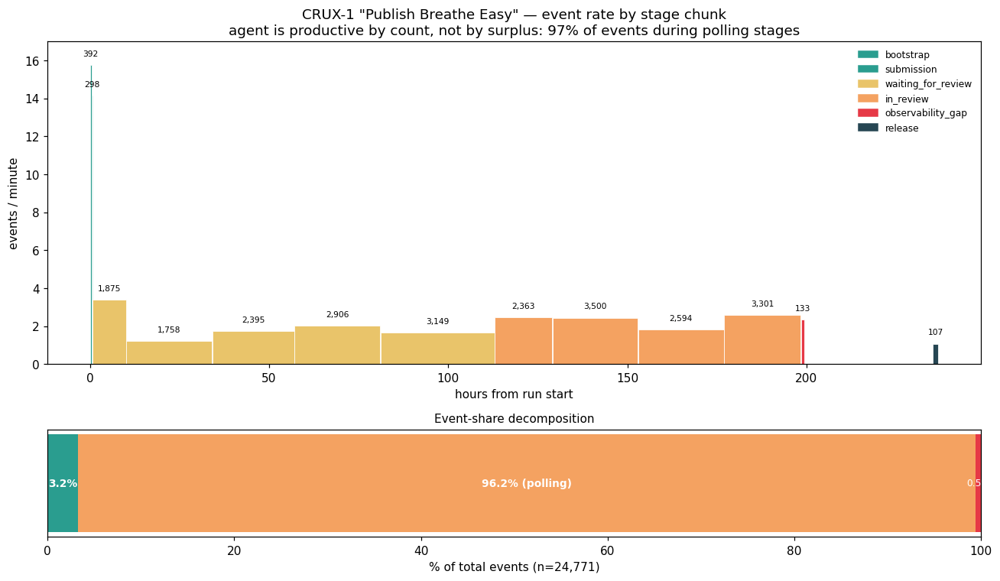

# Case study: CRUX-1 — productive by count, not by surplus

A 10-day open-world agent run — **Claude Opus 4.6 via OpenClaw** tasked with
"Publish *Breathe Easy* on the Apple App Store" — was conducted by NormalTech
as part of their CRUX-1 open-world evaluation (see
[*Open-world evaluations for measuring capability*](https://www.normaltech.ai/p/open-world-evaluations-for-measuring)).
Transluce's [Docent](https://docent.transluce.org/) then chunked the telemetry
into 13 analytic slices using the `crux1_telemetry_release_chunked` profile,
and SWARM received the chunk-level metadata as a CSV export. Decomposed by
stage category, the run is a clean real-world anchor for one of SWARM's
central claims: **agent output is not a proxy for agent surplus**.

## The headline number

Reproducible via `examples/analyze_docent_crux1.py` against the fixture at
`examples/data/docent_crux1_agent_runs.csv`:

| category | stages | events | % events | % time |
|---|---|---|---|---|
| **productive** | bootstrap, submission, release | 797 | **3.2%** | **1.2%** |
| **polling** | `waiting_for_review` ×5, `in_review` ×4 | 23,841 | **96.2%** | **98.3%** |
| observability_gap | (single chunk, Apple-side approval) | 133 | 0.5% | 0.5% |

Total: **24,771 events over 8.35 days**, of which **23,841 were status-poll
events against an external queue the agent could not influence**.



## Independent triangulation: three measurements, same ~97%

The NormalTech writeup on this exact run reports a total cost of approximately
**$1,000**, of which only **$25** was development and submission. That implies
**~97.5% of the compute budget was spent on status-check tokens** — which
triangulates the Docent-derived decomposition almost exactly:

| measurement | source | share going to polling |
|---|---|---|
| events | Docent chunk CSV (this repo) | **96.2%** |
| elapsed time | Docent chunk CSV (this repo) | **98.3%** |
| dollar cost | NormalTech writeup | **~97.5%** |

Three independent measurements of a single 10-day run — event counts from
Docent, wall-clock from Docent timestamps, and dollars from the operator —
converge on the same answer. This is the kind of agreement you want before
making a sharp claim.

## Behavioural corroboration in the chunk metadata

NormalTech report that "partway through the evaluation, the agent changed its
strategy to reduce the monitoring cost significantly: it started using
subagents rather than using the entire context, and began using shorter daily
memory files. This reduced the running cost from $35/hour to $3/hour."

That strategy pivot is visible in our CSV:

- **Chunk 3 → Chunk 4 event-rate drop**: `3.38 ev/min → 1.22 ev/min` (a 2.8×
  reduction) between the submission-night poll and the next day. The larger
  12× cost drop presumably combined this event-rate reduction with shorter
  context per event (subagents), which the chunk metadata does not surface.
- **`messages / event` drops below 1.0 in every waiting/review chunk** (range
  0.79–0.91) but sits at ~1.0 during productive chunks (bootstrap, submission).
  Sub-unity `msg/ev` is the signature of polling: many events that produce no
  new transcript content, i.e. duplicate status checks.

## Why this matters for SWARM

This is exactly the pathology the [soft payoff framework](theory.md) is
designed to surface:

- **`ProxyComputer` → `v_hat`**: an agent emitting 2–3 events/minute of
  "heartbeat monitoring and status polling with little visible change" (Docent's
  own chunk summary for the 5 waiting and 4 in-review slices) would score
  **high engagement**, **near-zero task_progress**, and non-trivial
  `rework_count` (duplicate polls). That combination drives `v_hat`
  negative, `p = σ(v_hat)` low, and `S_soft = p·s₊ − (1−p)·s₋ ≈ 0`.
- **Hard vs. soft metrics diverge**: hard event-count or message-count metrics
  would rank this run as highly active (~25k events, ~21k messages). Our soft
  metrics correctly assign near-zero expected surplus to the 96% of the run
  spent polling. That is the whole point of not collapsing to binary
  good/bad.
- **Governance-observation layer**: the 13th chunk is literally titled
  "Restart, Rediscovery, and Release" — telemetry dropped mid-review (chunk 12,
  the `observability_gap` stage), the agent was manually restarted, and upon
  restart it discovered state had already advanced to
  `PENDING_DEVELOPER_RELEASE` with a human green-light waiting. That is a
  natural experiment for the [governance observation layer](../..) with a
  pre/post boundary we did not have to synthesize. NormalTech themselves
  conclude that "post-hoc log analysis is not sufficient on its own to catch
  all unintended agent actions" — exactly the motivation for running
  governance signals *inline* rather than retrospectively.

## Non-inferrable boundaries

Several transitions in this run carry `p` values that **cannot be inferred from
agent outputs alone**: 2FA/credential handoff, manual restart after telemetry
loss, and human approval to release. Ground truth lives in an external oracle
(Apple App Review + the operator). SWARM's `SoftPayoffEngine` is designed for
exactly this case — harm and surplus internalisation depend on a signal the
agent does not emit — and it is rare to get a real-world run where those
oracle events are cleanly separable from the agent's own transcript.

## Limits of the CSV

The attached CSV carries only **chunk-level metadata**: summaries, stage labels,
event and message counts, window timestamps. To calibrate `p` per interaction
we would need the underlying transcripts / event streams, which Docent hosts
but did not export in this share. The Docent Python SDK is a candidate for a
follow-up spike; without it this case study is **illustrative, not
quantitative** at the per-event level.

## Reproducing the figure

```bash
python3 examples/analyze_docent_crux1.py
```

Reads `examples/data/docent_crux1_agent_runs.csv`, prints the per-chunk and
per-category decomposition, and regenerates
`docs/research/figures/crux1_event_decomposition.png`.

## Credits

- **Primary source**: NormalTech, [*Open-world evaluations for measuring
  capability*](https://www.normaltech.ai/p/open-world-evaluations-for-measuring).
  Designed and ran the CRUX-1 "Publish *Breathe Easy*" evaluation; logs and
  cost figures quoted above come from that writeup.
- **Telemetry chunking**: Transluce's [Docent](https://docent.transluce.org/)
  dashboard, via the `crux1_telemetry_release_chunked` profile.
- **Agent under observation**: Claude Opus 4.6 via the OpenClaw harness.
- See also the broader [CruxEvals survey](cruxevals-survey-analysis.md) notes
  for the larger open-world eval suite this task belongs to.
