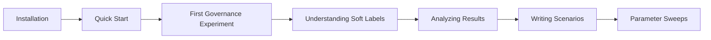

# Tutorials

Step-by-step tutorials for learning SWARM by doing.

-   :material-flask: **[Your First Governance Experiment](first-governance-experiment.md)**

    ---

    Build and run a governance experiment from scratch. Understand agents, scenarios, and results.

    **Time:** ~20 minutes | **Level:** Beginner

-   :material-sigma: **[Understanding Soft Labels](understanding-soft-labels.md)**

    ---

    Develop intuition for probabilistic labels. Walk through the math and see it in code.

    **Time:** ~15 minutes | **Level:** Intermediate

-   :material-chart-line: **[Analyzing Results](analyzing-results.md)**

    ---

    Interpret metrics, read plots, and draw conclusions from your experiments.

    **Time:** ~20 minutes | **Level:** Intermediate

## Learning Path

## Prerequisites

All tutorials assume:

- SWARM is [installed](../getting-started/installation.md)
- Python 3.10+
- Basic familiarity with Python

No prior knowledge of agent-based modeling or mechanism design is needed.
